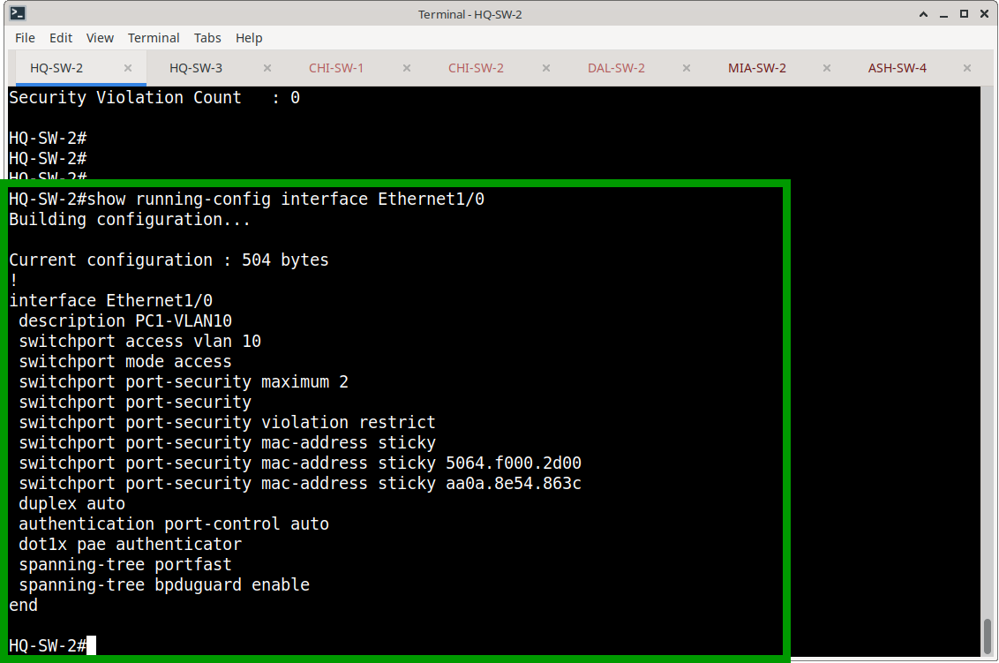
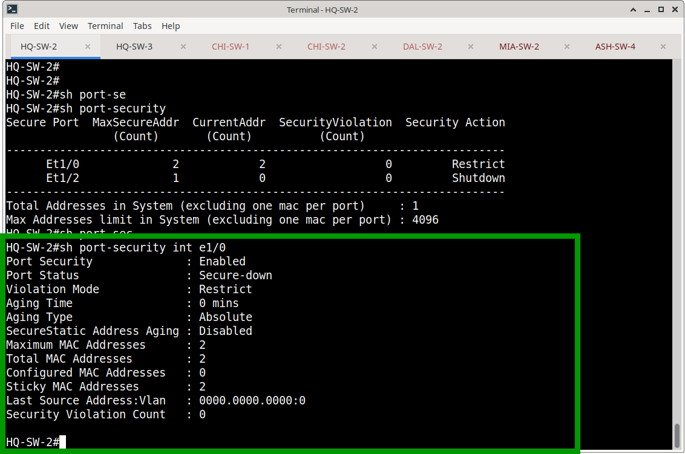
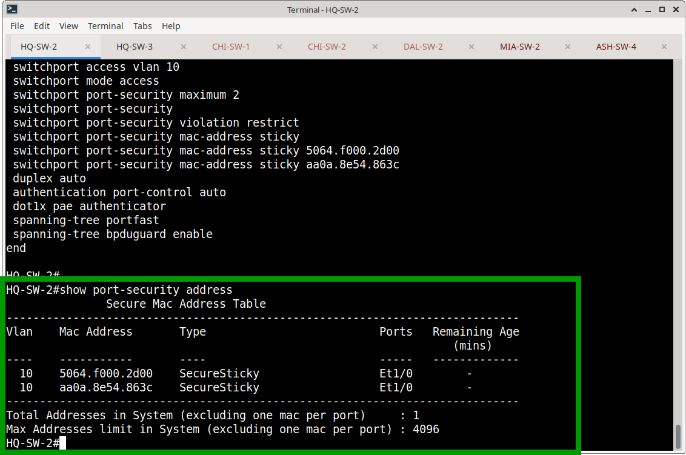
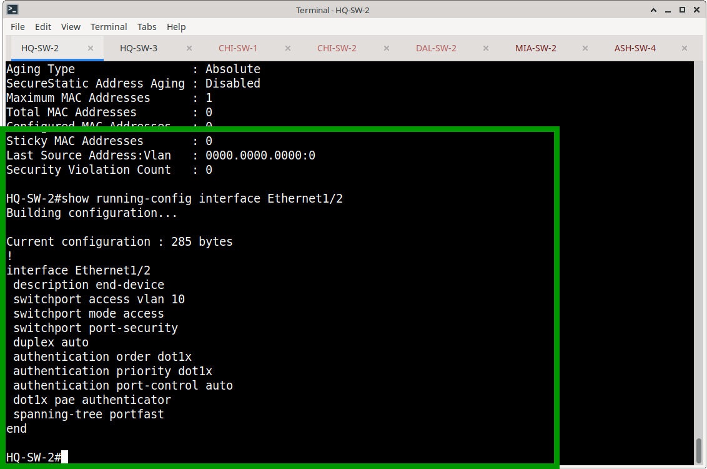
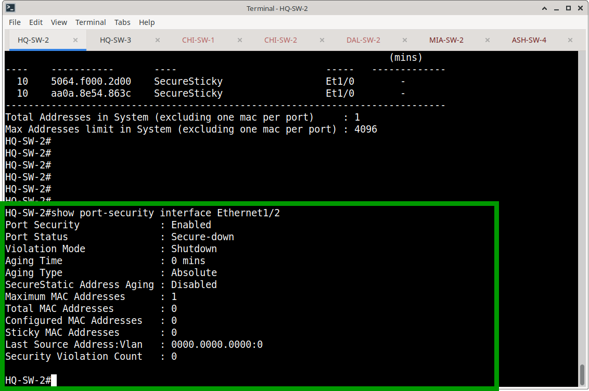
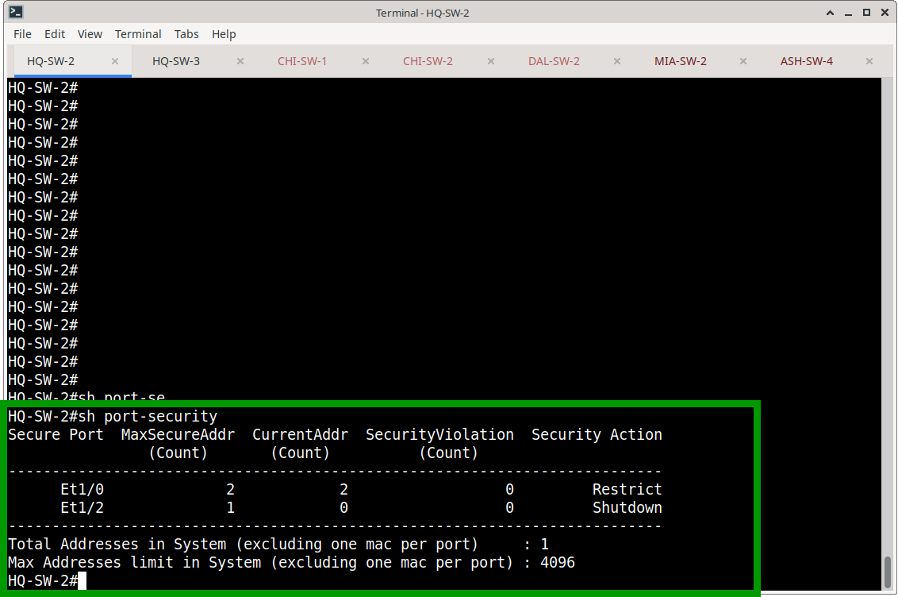

# Port Security — Implementation & State Verification

## 1. Implementation Overview

Port Security is configured on selected endpoint-facing access ports on HQ-SW-2. The configuration enforces MAC address limits, defines violation behaviors, and integrates with 802.1X and Spanning-Tree edge features.

---

## 2. Interface: Ethernet1/0 (PC1 Endpoint)

**Purpose:** Standard user endpoint requiring flexible MAC binding without hard port shutdowns on minor topology changes.

### Configuration
```cisco
interface Ethernet1/0
 description PC1-VLAN10
 switchport access vlan 10
 switchport mode access
 switchport port-security maximum 2
 switchport port-security violation restrict
 switchport port-security mac-address sticky
 duplex auto
 authentication port-control auto
 dot1x pae authenticator
 spanning-tree portfast
 spanning-tree bpduguard enable
```


### Operational State & Secure MAC Table
The interface is currently in a `Secure-up` state with both allowed MAC addresses learned and bound via sticky learning.

```text
Port Security              : Enabled
Port Status                : Secure-up
Violation Mode             : Restrict
Maximum MAC Addresses      : 2
Total MAC Addresses        : 2
Sticky MAC Addresses       : 2
Security Violation Count   : 0
```


**Bound MAC Addresses:**
```text
Vlan    Mac Address       Type           Ports
----    -----------       ----           -----
10      5064.f000.2d00    SecureSticky   Et1/0
10      aa0a.8e54.863c    SecureSticky   Et1/0
```


---

## 3. Interface: Ethernet1/2 (Printer / MAB Endpoint)

**Purpose:** Static IoT/Printer endpoint requiring strict single-device isolation.

### Configuration
```cisco
interface Ethernet1/2
 description PRINTER-MAB-TEST
 switchport access vlan 10
 switchport mode access
 switchport port-security maximum 1
 switchport port-security violation shutdown
 duplex auto
 authentication order dot1x
 authentication priority dot1x
 authentication port-control auto
 dot1x pae authenticator
 spanning-tree portfast
```


### Operational State
The interface is currently in a `Secure-down` state, awaiting the first legitimate MAC address to bind. No violations have occurred.

```text
Port Security              : Enabled
Port Status                : Secure-down
Violation Mode             : Shutdown
Maximum MAC Addresses      : 1
Total MAC Addresses        : 0
Sticky MAC Addresses       : 0
Security Violation Count   : 0
```


---

## 4. Switch-Wide Port Security Summary

The consolidated view of HQ-SW-2 confirms both profiles are active and functioning as designed:

```text
Secure Port  MaxSecureAddr  CurrentAddr  SecurityViolation  Security Action
      Et1/0              2            2                  0         Restrict
      Et1/2              1            0                  0         Shutdown
```


---

## 5. Verification Commands

The following commands were utilized to capture the state documented above:

- `show port-security` *(Switch-wide summary)*
- `show port-security interface [interface]` *(Detailed per-port state)*
- `show port-security address` *(Secure MAC address table)*
- `show running-config interface [interface]` *(Configuration validation)*

---

## 6. Separation of Concerns

This directory strictly documents the **design implementation and current operational state**. 

Behavioral testing—such as connecting rogue devices to trigger violation counters, observing restrict-mode packet drops, and verifying shutdown-mode `err-disabled` transitions—is maintained separately in the project's verification documentation.
