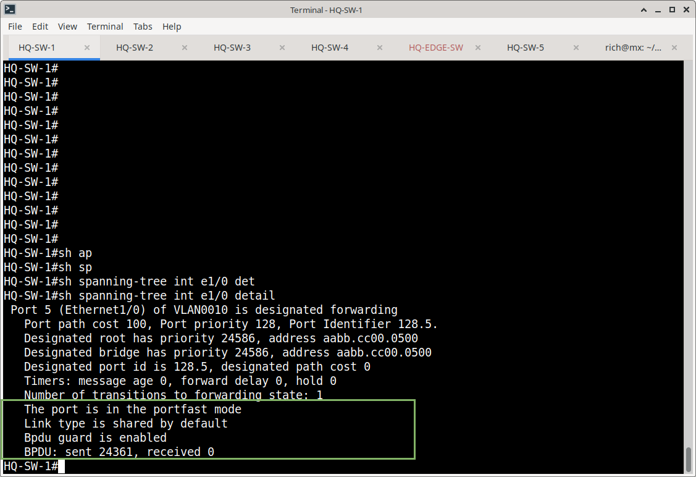
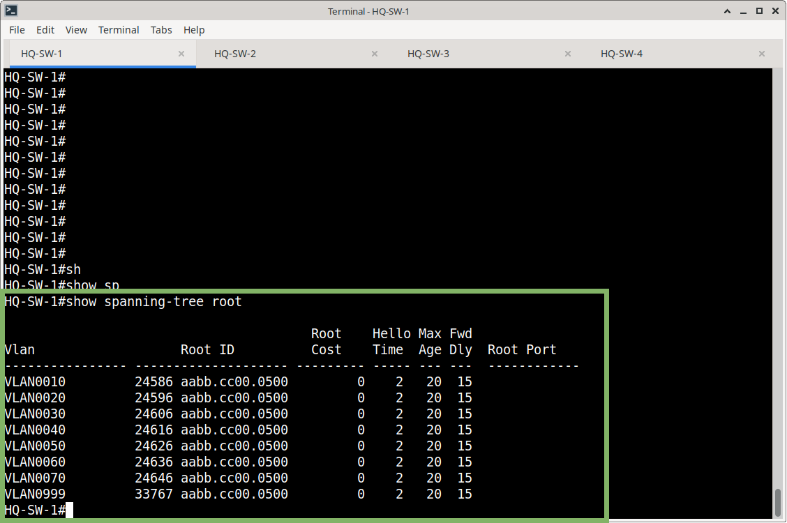
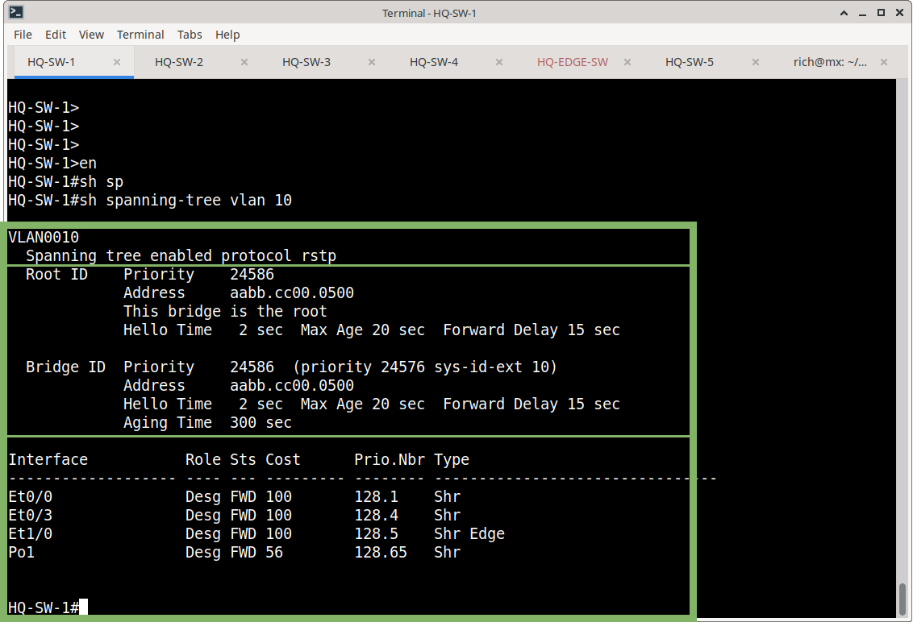

# Spanning Tree Protocol (STP)

## Overview

This section documents Spanning Tree Protocol (STP) implementation and verification for the Meridian Financial Services enterprise network.

The switching environment uses Rapid-PVST configuration to provide Layer 2 loop prevention and rapid convergence while maintaining VLAN-specific spanning-tree instances.

STP is used to:

- Prevent Layer 2 switching loops
- Provide redundant Layer 2 paths
- Determine forwarding and blocking ports
- Establish a predictable root bridge
- Protect endpoint-facing ports with PortFast and BPDU Guard
- Maintain stable Layer 2 forwarding across redundant switch links

---

## STP Design

The HQ switching environment uses Rapid-PVST:

```text
spanning-tree mode rapid-pvst
```

HQ-SW-1 is configured with the lowest STP priority and operates as the root bridge for the documented HQ VLANs.

### HQ Root Bridge

HQ-SW-1

Root bridge for:

- VLAN 10 - USERS
- VLAN 20 - VOICE
- VLAN 30 - SERVERS
- VLAN 40 - GUEST
- VLAN 50 - MANAGEMENT
- VLAN 60 - PRINTERS/IoT
- VLAN 70 - NETWORK INFRASTRUCTURE
- VLAN 999 - NATIVE_UNUSED

HQ-SW-1 uses:

```text
spanning-tree vlan 10,20,30,40,50,60,70 root primary 
```

### Endpoint Port Protection

Endpoint-facing access ports use:

```text
spanning-tree portfast
spanning-tree bpduguard enable
```

PortFast allows an endpoint port to transition rapidly toward forwarding.

BPDU Guard protects endpoint-facing ports by preventing an unexpected switch or other Layer 2 device from establishing a spanning-tree relationship on the port.

**SW1: sh spanning-tree interface e1/0 detail**



### HQ STP Verification

The HQ switching topology was verified using:

```text
show spanning-tree root
show spanning-tree vlan 10
show spanning-tree interface <interface> detail
```

The verification confirmed HQ-SW-1 as the root bridge for the documented HQ VLANs.

The other HQ switches use their available redundant paths to reach the root bridge.






#### Verified Root Paths

| Switch | Root Path |
|---|---|
| HQ-SW-1 | Root bridge |
| HQ-SW-2 | Port-channel1 |
| HQ-SW-3 | Ethernet0/3 |
| HQ-SW-4 | Port-channel1 |

---

## Evidence

Screenshots and command output for this section are stored under:

```text
Switching/STP/screenshots/
```

Recommended evidence includes:

- `show spanning-tree root`
- `show spanning-tree vlan 10`
- `show spanning-tree interface <endpoint> detail`
- Endpoint PortFast/BPDU Guard configuration

---

## Scope

This section documents STP implementation and verification for the switching portion of the Meridian network.

Routing protocols such as OSPF and BGP are documented separately under the routing documentation.
