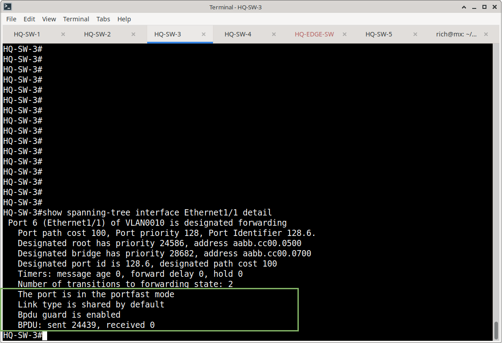
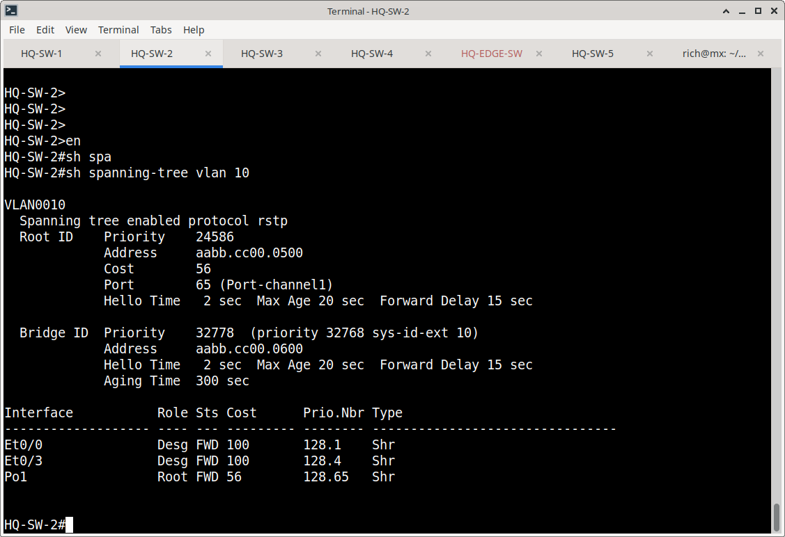
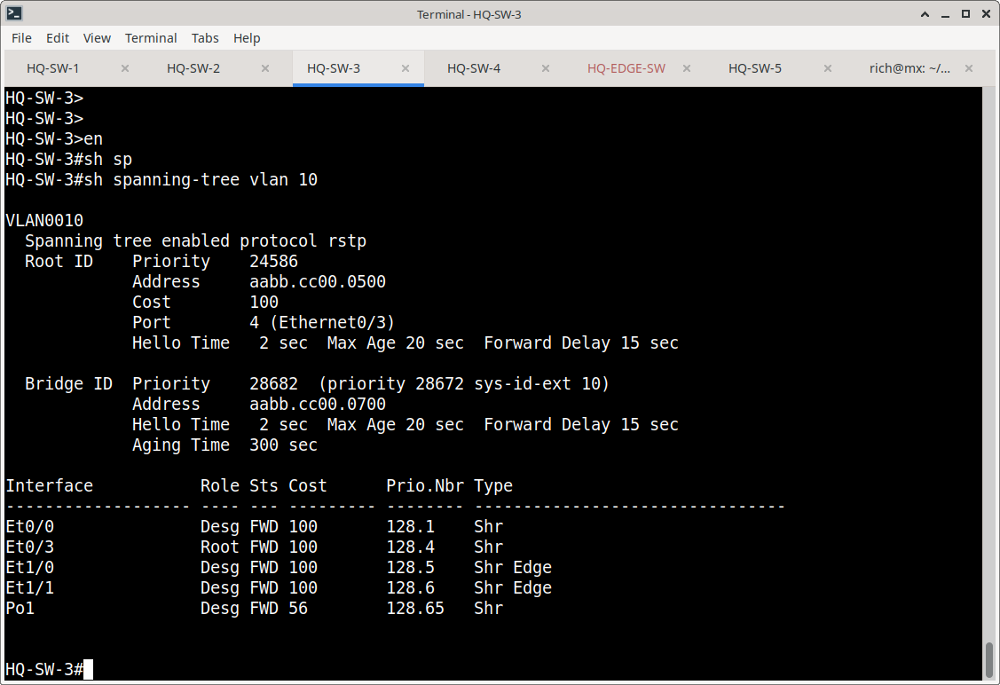
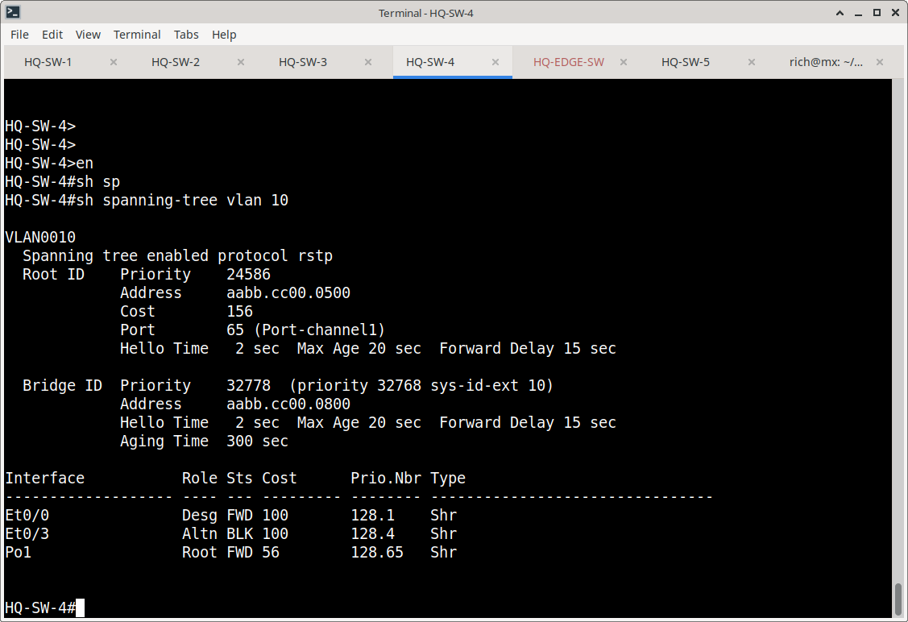
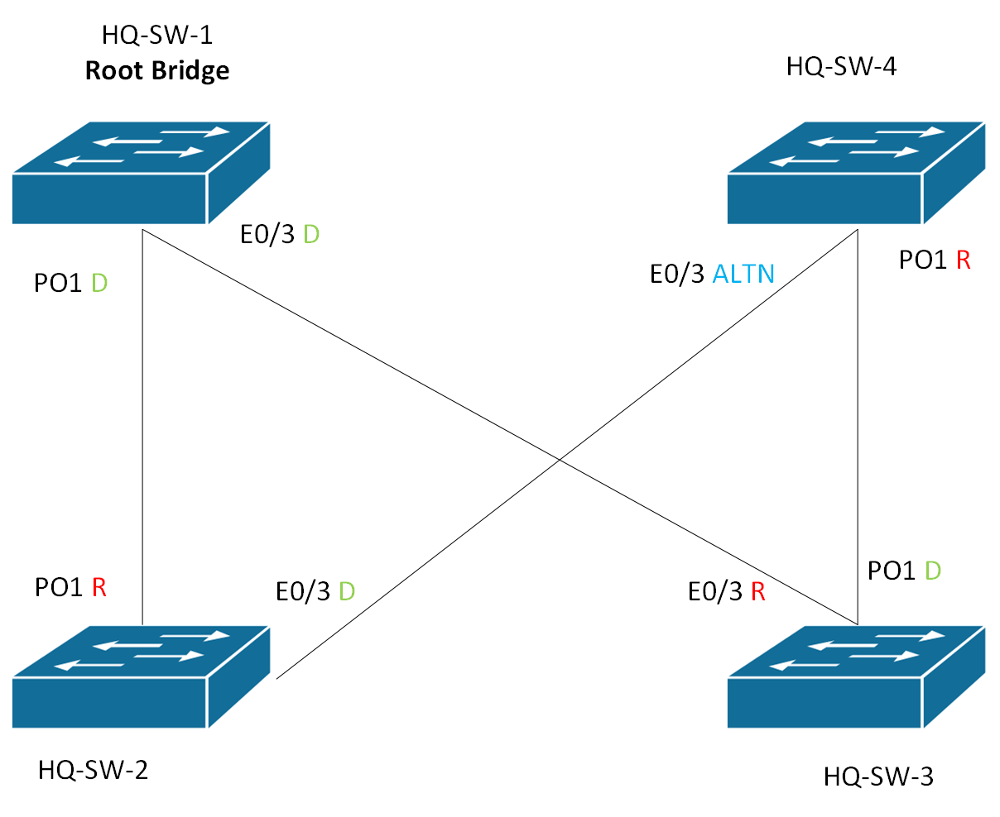

# STP Configuration

## 1. STP Mode

The switching environment uses Rapid-PVST.

Configuration:

```cisco
spanning-tree mode rapid-pvst
```

Rapid-PVST provides a separate spanning-tree instance per VLAN while allowing rapid transition and convergence behavior.

---

## 2. HQ Root Bridge

HQ-SW-1 is configured as the primary root bridge for the HQ VLANs.

Configured VLANs:

- 10
- 20
- 30
- 40
- 50
- 60
- 70
- 999

HQ-SW-1 uses a lower STP priority than the other HQ switches.

Example configuration:

```cisco
spanning-tree vlan 10,20,30,40,50,60,70 root primary
```

The extended system ID is reflected in the operational bridge priority.


---

## 3. HQ-SW-3 STP Priority

HQ-SW-3 is configured with a higher priority than HQ-SW-1:

```cisco
spanning-tree vlan 10,20,30,40,50,60,70 priority 28672
```

This prevents HQ-SW-3 from becoming the primary root while maintaining it as a redundant Layer 2 switch.

---

## 4. Endpoint Port Protection

Endpoint-facing ports use PortFast and BPDU Guard.

Standard configuration:

```cisco
interface Ethernet1/0
 spanning-tree portfast
 spanning-tree bpduguard enable
```

PortFast is used on endpoint-facing access ports.

BPDU Guard is enabled to protect those ports from unexpected BPDUs.

---

## 5. HQ-SW-1 Endpoint Configuration

HQ-SW-1 Ethernet1/0 is an endpoint-facing access port.

Relevant configuration:

```cisco
interface Ethernet1/0
 switchport access vlan 10
 switchport mode access
 spanning-tree portfast
 spanning-tree bpduguard enable
```

Operational verification showed:

```text
The port is in the portfast mode
Bpdu guard is enabled
BPDU: sent 27416, received 0
```

The interface was in the designated forwarding state.


---

## 6. HQ-SW-3 Endpoint Configuration

HQ-SW-3 Ethernet1/0 is an endpoint-facing access port.

Relevant STP configuration:

```cisco
interface Ethernet1/0
 spanning-tree portfast
 spanning-tree bpduguard enable
```

Operational verification showed:

```text
The port is in the portfast mode
Bpdu guard is enabled
BPDU: sent 27390, received 0
```

The interface was in the designated forwarding state.



---

## 7. STP Verification

### HQ-SW-1

VLAN 10 verification:

```text
show spanning-tree vlan 10
```

Result:

```text
Root ID    Priority    24586
           Address     aabb.cc00.0500
           This bridge is the root
```

HQ-SW-1 is therefore the root bridge for VLAN 10.


### HQ-SW-2

VLAN 10 verification showed:

```text
Root ID    Priority    24586
           Address     aabb.cc00.0500
           Cost        56
           Port        65 (Port-channel1)
```

Port roles included:

```text
Et0/0    Desg FWD
Et0/3    Altn BLK
Po1      Root FWD
```

This confirms Port-channel1 as the root path toward HQ-SW-1 and Ethernet0/3 as an alternate blocking path.



### HQ-SW-3

VLAN 10 verification showed:

```text
Root ID    Priority    24586
           Address     aabb.cc00.0500
           Cost        100
           Port        4 (Ethernet0/3)
```

The root path is Ethernet0/3.

The interface roles included:

```text
Et0/0    Desg FWD
Et0/3    Root FWD
Et1/0    Desg FWD
Et1/1    Desg FWD
Po1      Desg FWD
```



### HQ-SW-4

VLAN 10 verification showed:

```text
Root ID    Priority    24586
           Address     aabb.cc00.0500
           Cost        56
           Port        65 (Port-channel1)
```

The root path is Port-channel1.

The interface roles included:

```text
Et0/0    Desg FWD
Et0/3    Desg FWD
Po1      Root FWD
```



---

## 10. HQ Root Bridge Summary

The verified HQ STP topology is:



```

The actual physical topology contains additional redundant links. STP determines which paths forward and which paths remain alternate/blocking paths.

For VLAN 10:

- HQ-SW-1 = Root
- HQ-SW-2 = Root port Po1
- HQ-SW-3 = Root port Ethernet0/3
- HQ-SW-4 = Root port Po1
```
---

## 11. Verification Commands

The following commands were used for STP verification:

```text
show spanning-tree root
show spanning-tree vlan 10
show spanning-tree interface <interface> detail
```

These commands verify:

- Root bridge selection
- Root path
- Root port
- Designated ports
- Alternate/blocking ports
- PortFast configuration
- BPDU Guard configuration
- Endpoint STP behavior

---

## 12. Evidence

Screenshots should be stored in:

```text
Switching/STP/screenshots/
```

Recommended filenames:

```text
hq-sw1-stp-root.png
hq-sw2-stp-root.png
hq-sw3-stp-root.png
hq-sw4-stp-root.png

hq-sw1-stp-vlan-10.png
hq-sw2-stp-vlan-10.png

hq-sw1-sh-int-e1-0-detail.png
hq-sw3-sh-int-e1-1-detail.png

```
