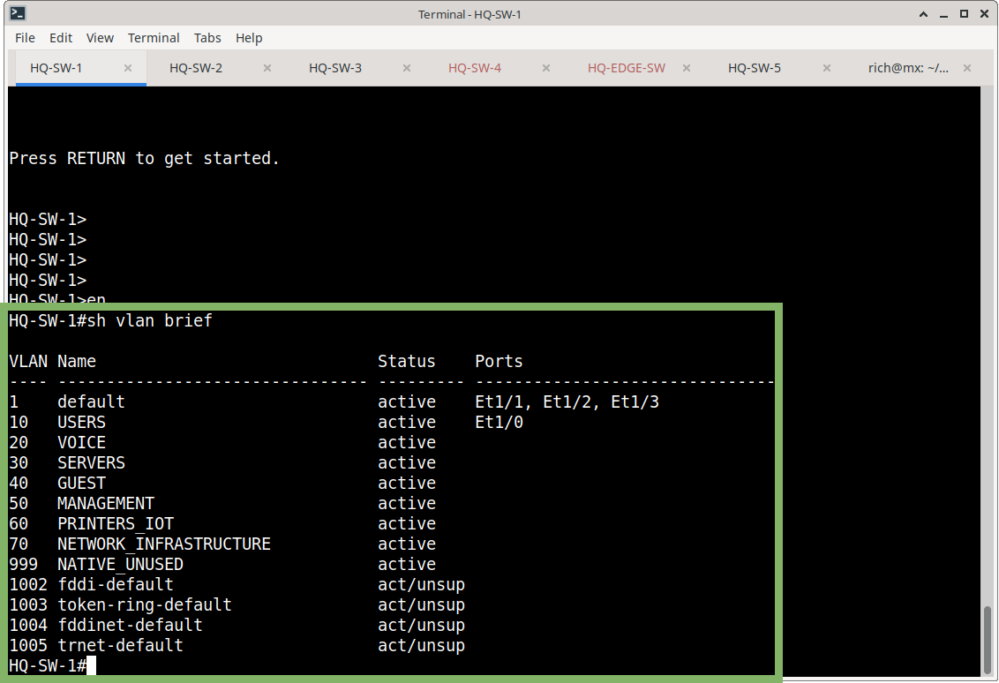
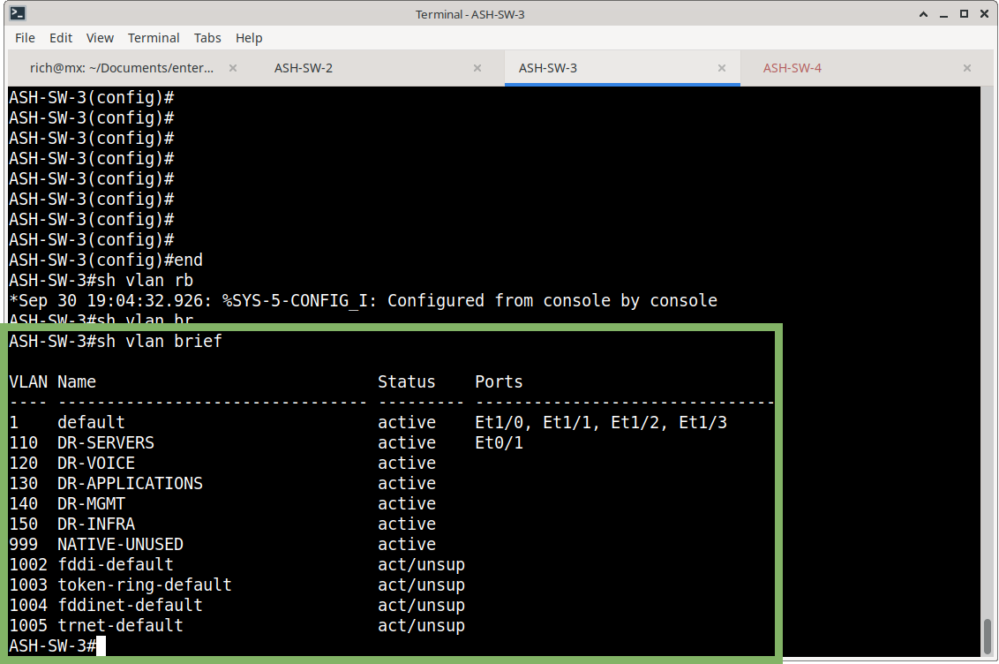
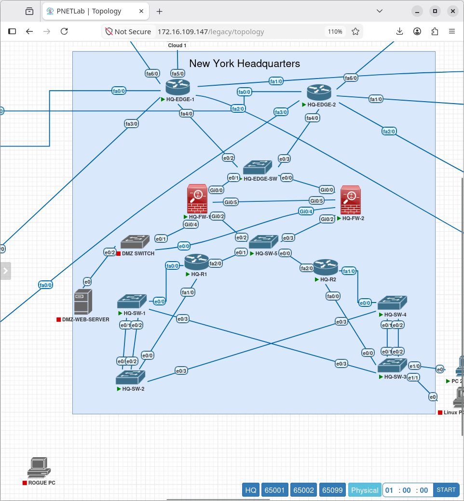
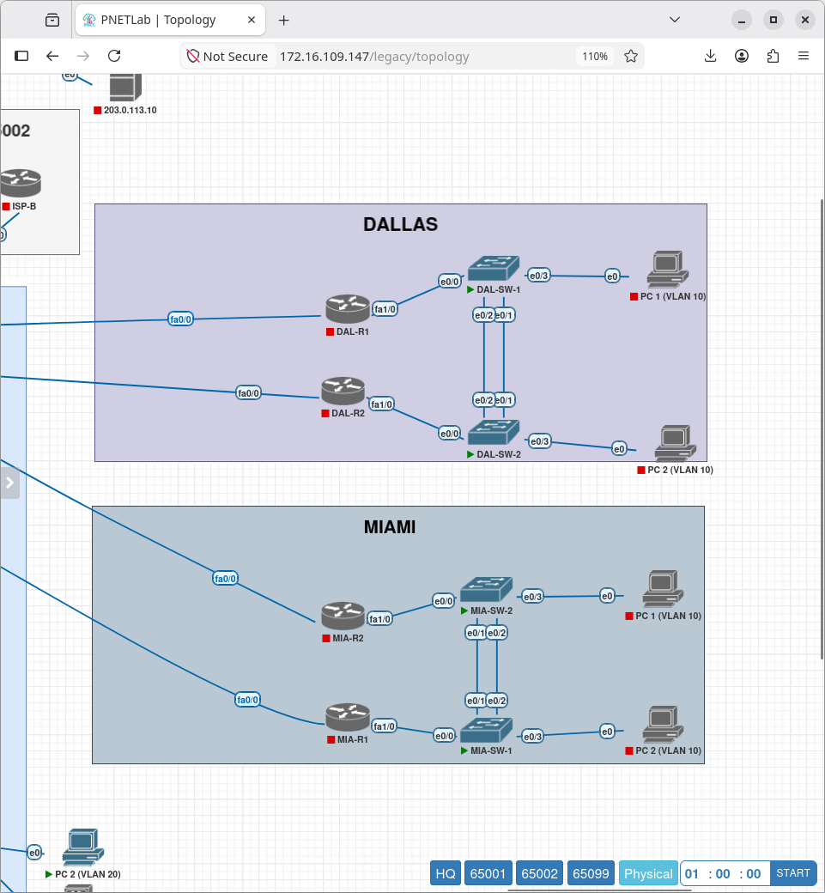
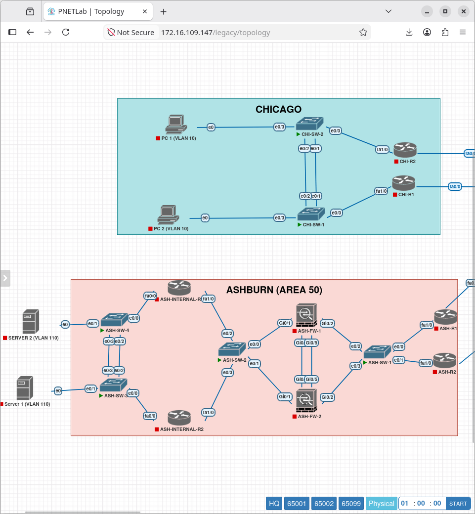
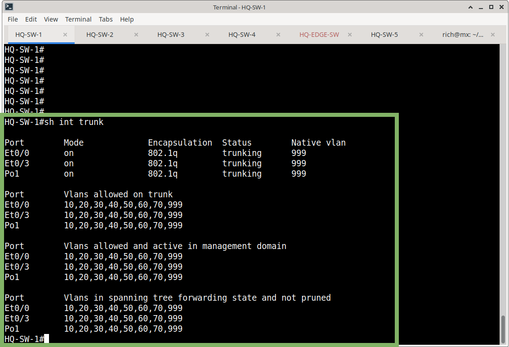
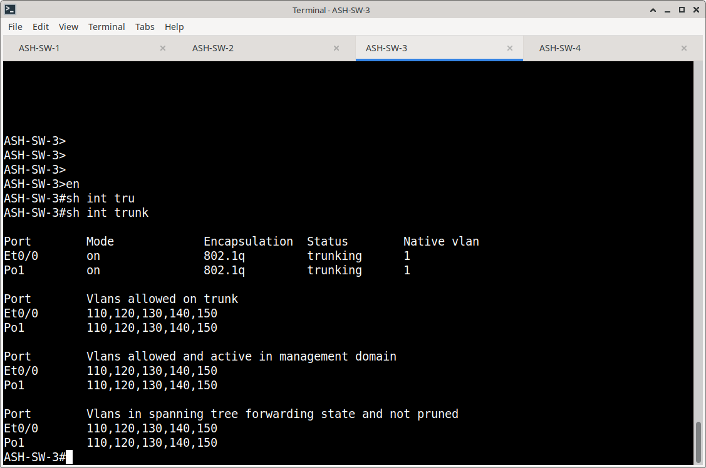

# VLAN Configuration & Verification

## Overview

This section documents the VLAN architecture used throughout the Meridian Financial Services enterprise network.

VLANs provide logical Layer 2 segmentation for users, voice, servers, guest devices, management, printers/IoT devices, and network infrastructure.

The VLAN design is implemented across the headquarters and branch switching infrastructure while preserving site-specific VLAN requirements.

---

## VLAN Design

### Headquarters / Standard Branch VLANs

| VLAN | Name | Purpose |
|---:|---|---|
| 10 | USERS | User workstation and endpoint traffic |
| 20 | VOICE | Voice/VoIP traffic |
| 30 | SERVERS | Server infrastructure |
| 40 | GUEST | Guest network traffic |
| 50 | MANAGEMENT | Network device management |
| 60 | PRINTERS_IOT | Printers and IoT devices |
| 70 | NETWORK_INFRASTRUCTURE | Network infrastructure services |
| 999 | NATIVE_UNUSED | Unused/native VLAN |

These VLANs are carried across the required 802.1Q trunk links.



### Ashburn

Ashburn uses a site-specific VLAN range:

| VLAN | Purpose |
|---:|---|
| 110 | DR-SERVERS |
| 120 | DR-VOICE |
| 130 | DR-APPLICATIONS |
| 140 | DR-MGMT |
| 150 | DR-INFRA |
| 999 | NATIVE-UNUSED |

The Ashburn switching configuration uses VLANs 110–150 on the trunk infrastructure.



---

## Switching Implementation

### Headquarters

The primary HQ access switches are:

- HQ-SW-1
- HQ-SW-2
- HQ-SW-3
- HQ-SW-4

HQ-SW-5 and HQ-EDGE-SW operate as infrastructure/uplink switches rather than endpoint access switches.

HQ access switches use:

- 802.1Q trunking
- Access VLAN assignments
- Rapid-PVST/PVST
- LACP EtherChannel
- VLAN 999 for unused/native VLAN purposes
- 802.1X on endpoint access ports
- Port-Security



### Branches

Standard branch switching includes:

- Chicago
- Dallas
- Miami

Each standard branch contains two switches with:

- A router-facing trunk
- An LACP EtherChannel between switches
- Endpoint access ports
- VLANs 10–70 and 999

 

### Ashburn

Ashburn uses four switches.

ASH-SW-1 and ASH-SW-2 provide infrastructure/transit connectivity.

ASH-SW-3 and ASH-SW-4 provide endpoint access switching and use VLANs 110–150.



---

## Access Port Security

Endpoint access ports are configured with:

```text
switchport mode access
switchport access vlan <VLAN>
authentication port-control auto
dot1x pae authenticator
spanning-tree portfast
spanning-tree bpduguard enable
switchport port-security
switchport port-security maximum 2
switchport port-security violation restrict
switchport port-security mac-address sticky

```

Unused endpoint-capable ports are placed into VLAN 999, administratively shut down, and receive the same access-port protection.

---

## Trunking

Infrastructure trunk links use 802.1Q encapsulation.

Standard HQ/branch trunks carry:

```text
10,20,30,40,50,60,70,999
```


Ashburn trunks carry:

```text
110,120,130,140,150
```



---

## EtherChannel

Where redundant switch-to-switch links are present, LACP is used to form EtherChannels.

The physical member interfaces are configured as trunk ports and participate in the corresponding Port-channel.


---

## Verification

VLAN configuration is verified using:

```text
show vlan brief
show interfaces trunk
show interfaces <interface> switchport
```

These commands verify:

- VLAN existence
- VLAN names
- Access-port assignments
- Trunk VLAN membership
- Native VLAN configuration
- Operational switchport mode

---

## Evidence

Screenshots documenting VLAN configuration and verification are stored in:

```text
VLAN/screenshots/
```
---

## Related Configuration

Switch configurations are stored in:

```text
Switching/configs/
```

Related switching documentation:

```text
Switching/
├── VLAN/
├── STP/
├── EtherChannel-LACP/
├── Port-Security/
└── BPDU-Guard/
```
