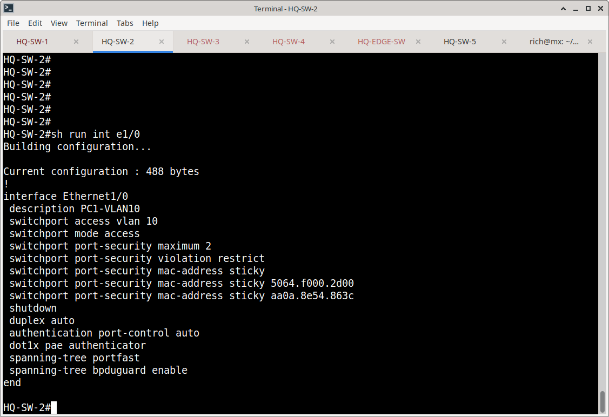
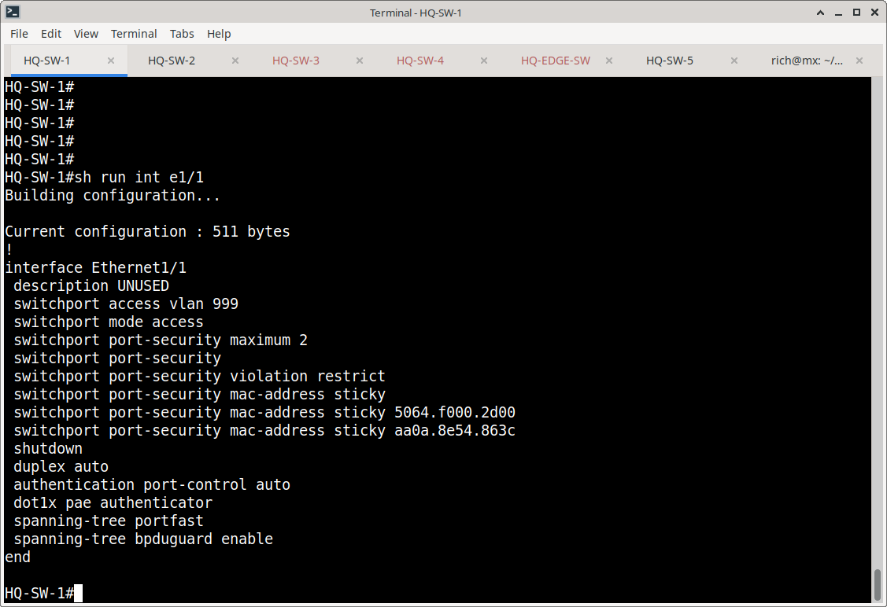
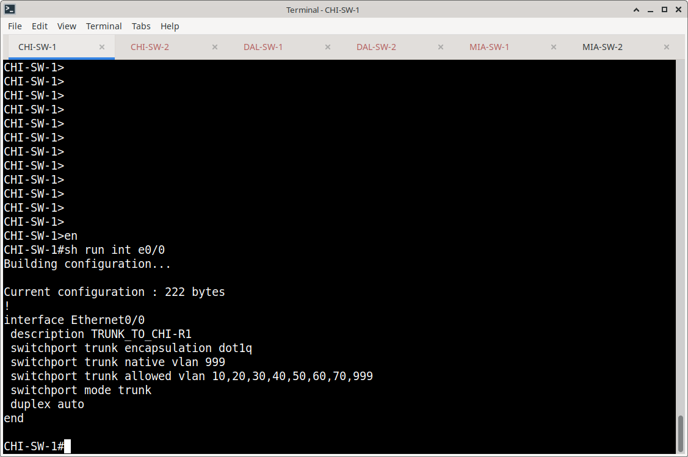
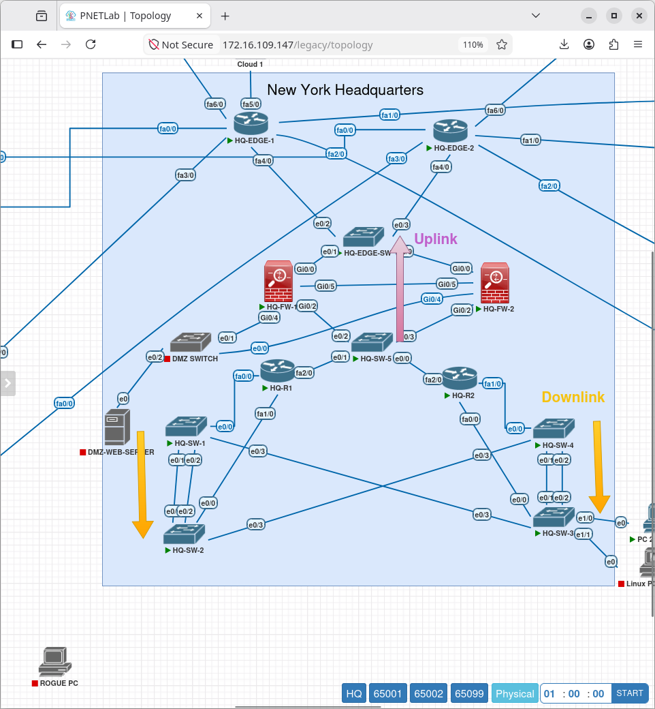
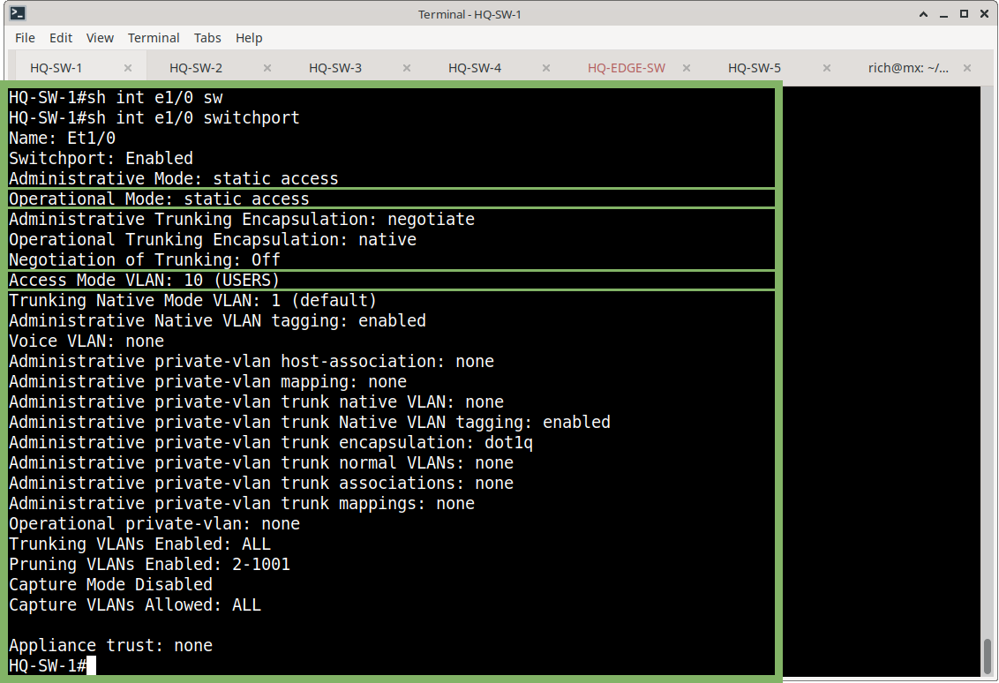

# VLAN Configuration

## Purpose

This document describes the VLAN implementation used within the Meridian Financial Services network.

The design separates traffic into logical Layer 2 broadcast domains while allowing required VLANs to traverse the enterprise switching infrastructure through 802.1Q trunks.

---

# 1. Standard Enterprise VLANs

The primary enterprise VLAN structure is:

| VLAN | Name | Function |
|---:|---|---|
| 10 | USERS | User endpoint traffic |
| 20 | VOICE | Voice traffic |
| 30 | SERVERS | Server traffic |
| 40 | GUEST | Guest traffic |
| 50 | MANAGEMENT | Network management |
| 60 | PRINTERS_IOT | Printers and IoT devices |
| 70 | NETWORK_INFRASTRUCTURE | Network infrastructure |
| 999 | NATIVE_UNUSED | Unused/native VLAN |

---

# 2. VLAN Creation

The standard VLANs are defined on the access switching infrastructure.

Example:

```cisco
vlan 10
 name USERS
!
vlan 20
 name VOICE
!
vlan 30
 name SERVERS
!
vlan 40
 name GUEST
!
vlan 50
 name MANAGEMENT
!
vlan 60
 name PRINTERS_IOT
!
vlan 70
 name NETWORK_INFRASTRUCTURE
!
vlan 999
 name NATIVE_UNUSED
```

---

# 3. Access Port Configuration

Endpoint interfaces are configured as Layer 2 access ports.

Example:

```cisco
interface Ethernet1/0
 description PC1-VLAN10
 switchport access vlan 10
 switchport mode access
 duplex auto
 authentication port-control auto
 dot1x pae authenticator
 spanning-tree portfast
 spanning-tree bpduguard enable
 switchport port-security maximum 2
 switchport port-security violation restrict
 switchport port-security mac-address sticky
 switchport port-security mac-address sticky 5064.f000.2d00
 switchport port-security mac-address sticky aa0a.8e54.863c
 switchport port-security

```

The access VLAN determines the endpoint's Layer 2 broadcast domain.



---

# 4. Unused Access Ports

Unused ports are placed into VLAN 999 and administratively disabled.

Example:

```cisco
interface Ethernet1/1
 description UNUSED
 switchport mode access
 switchport access vlan 999
 shutdown
 duplex auto
 authentication port-control auto
 dot1x pae authenticator
 spanning-tree portfast
 spanning-tree bpduguard enable
 switchport port-security maximum 2
 switchport port-security violation restrict
 switchport port-security mac-address sticky
 switchport port-security mac-address sticky 5064.f000.2d00
 switchport port-security mac-address sticky aa0a.8e54.863c
 switchport port-security
```

VLAN 999 is used as the designated unused/native VLAN rather than assigning unused interfaces to a production user VLAN.



---

# 5. Trunk Configuration

HQ and standard branch infrastructure trunks carry the required enterprise VLANs.

Example:

```cisco
interface Ethernet0/0
 description TRUNK-TO-ROUTER
 switchport trunk encapsulation dot1q
 switchport trunk native vlan 999
 switchport trunk allowed vlan 10,20,30,40,50,60,70,999
 switchport mode trunk
```

The trunk configuration provides VLAN connectivity between the switching infrastructure and router-on-a-stick interfaces.



---

# 6. EtherChannel Trunks

Switch-to-switch links use LACP.

Example:

```cisco
interface Ethernet0/1
 description LACP-TO-SWITCH
 switchport trunk encapsulation dot1q
 switchport trunk native vlan 999
 switchport trunk allowed vlan 10,20,30,40,50,60,70,999
 switchport mode trunk
 duplex auto
 channel-group 1 mode active
!
interface Ethernet0/2
 description LACP-TO-SWITCH
 switchport trunk encapsulation dot1q
 switchport trunk native vlan 999
 switchport trunk allowed vlan 10,20,30,40,50,60,70,999
 switchport mode trunk
 duplex auto
 channel-group 1 mode active
!
interface Port-channel1
 switchport
 switchport trunk encapsulation dot1q
 switchport trunk native vlan 999
 switchport trunk allowed vlan 10,20,30,40,50,60,70,999
 switchport mode trunk
```

LACP configuration is documented separately under:

```text
Switching/EtherChannel-LACP/
```

---

# 7. Ashburn VLAN Configuration

Ashburn uses a site-specific VLAN structure:

| VLAN | Purpose |
|---:|---|
| 110 | DR-SERVERS |
| 120 | DR-VOICE |
| 130 | DR-APPLICATIONS |
| 140 | DR-MGMT |
| 150 | DR-INFRA |
| 999 | NATIVE-UNUSED |

Ashburn trunk interfaces allow:

```cisco
switchport trunk allowed vlan 110,120,130,140,150
```

Example access-port configuration:

```cisco
interface Ethernet0/1
 description ACCESS-VLAN110
 switchport access vlan 110
 switchport mode access
 duplex auto
 authentication port-control auto
 dot1x pae authenticator
 spanning-tree portfast
 spanning-tree bpduguard enable
```

---

# 8. Switch Roles

## HQ Access Switches

The following switches provide endpoint access switching:

- HQ-SW-1
- HQ-SW-2
- HQ-SW-3
- HQ-SW-4

These switches provide access ports, VLAN assignment, trunking, LACP, and endpoint security features.

## HQ Infrastructure/Uplink Switches

- HQ-SW-5
- HQ-EDGE-SW

These switches provide infrastructure/uplink connectivity between routers and firewalls.

They are not configured as endpoint access switches.



## Standard Branch Switches

- CHI-SW-1
- CHI-SW-2
- DAL-SW-1
- DAL-SW-2
- MIA-SW-1
- MIA-SW-2

Each pair provides router connectivity, LACP switch-to-switch connectivity, and endpoint access.

## Ashburn Switches

- ASH-SW-1
- ASH-SW-2

Infrastructure/transit switching.

- ASH-SW-3
- ASH-SW-4

Endpoint access switching.

---

# 9. Verification Commands

## VLAN Database

```text
show vlan brief
```

Used to verify:

- VLAN IDs
- VLAN names
- VLAN status
- Access-port membership


## Trunk Verification

```text
show interfaces trunk
```

Used to verify:

- Operational trunk interfaces
- Native VLAN
- Allowed VLANs
- VLANs active on trunks
- VLANs forwarding through the trunk


## Access Port Verification

```text
show interfaces Ethernet1/0 switchport
```

Used to verify:

- Administrative mode
- Operational mode
- Access VLAN
- Trunking state
- Native VLAN



---

# 10. Verification Evidence

The VLAN verification screenshots are stored under:

```text
VLAN/screenshots/
```
---

# 11. Design Notes

VLAN configuration is intentionally separated from routing.

VLANs provide Layer 2 segmentation, while inter-VLAN routing is handled by the Meridian router infrastructure using the Router-on-a-Stick design.

VLAN 50 provides network management connectivity.

VLAN 999 is reserved for native/unused-port handling and is not used as a normal endpoint production VLAN.
