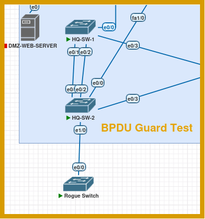
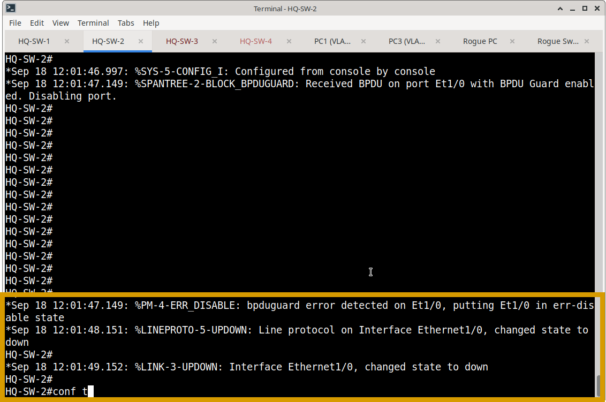
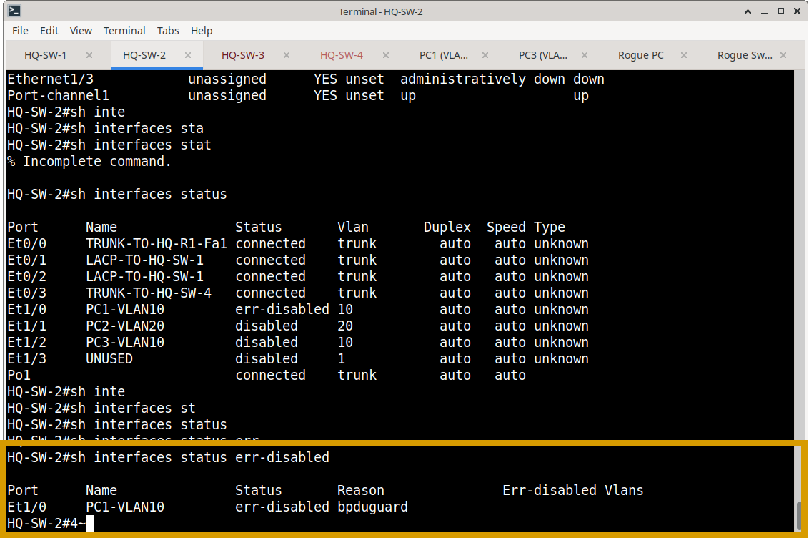

# BPDU Guard Operational Verification & Loop Prevention Testing

## Objective

Validate that BPDU Guard effectively protects the Layer 2 edge of the Meridian switching infrastructure. Verification ensures that PortFast-enabled access ports immediately disable themselves upon receiving unexpected Bridge Protocol Data Units (BPDUs), preventing accidental or malicious network loops.

---

## 1. Steady-State Operational Verification

The following commands were utilized to verify the baseline health and configuration of BPDU Guard on endpoint-facing access ports.

| Verification Area | Command | Validation Criteria |
| :--- | :--- | :--- |
| **Edge Port STP State** | `show spanning-tree interface [id] detail` | • Port is operating in `portfast` mode. • `Bpdu guard is enabled` is explicitly stated. • BPDU received count is `0` (indicating no rogue devices are currently connected). |
| **Configuration Audit** | `show running-config interface [id]` | • `spanning-tree portfast` is applied. • `spanning-tree bpduguard enable` is applied. • Configuration is strictly limited to access ports; trunk and EtherChannel interfaces are excluded. |

---

## 2. Functional Security Testing (Loop Prevention)

While steady-state verification proves the feature is configured, functional testing proves it actively protects the network topology when a threat is introduced.

### Test Methodology
1. **Baseline State:** Verified the target interface (e.g., HQ-SW-2 Ethernet1/1) was in an `up/up` state with PortFast and BPDU Guard active.
2. **Threat Injection:** Connected a rogue switch (or simulated a device sending BPDUs) to the protected endpoint access port.
3. **Observation:** Monitored the interface state, spanning-tree status, and system logging for the switch's response.

### Test Results
* **Immediate Isolation:** Upon receiving the unexpected BPDU, the switch immediately transitioned the interface to an **`err-disabled`** state.
* **Topology Protection:** The port was effectively shut down at Layer 2, dropping all traffic and preventing the rogue device from participating in or disrupting the spanning-tree topology.
* **Administrative Alert:** The event generated a syslog message, alerting network operations to the physical security violation.

**BPDU Guard Test Topology**

**HQ-SW-2 Violation syslog**

**HQ-SW-2 show interfaces status err-disabled**

---

## 3. Evidence & Artifacts

### Operational Screenshots
Representative steady-state verification screenshots are stored in:
`Switching/Verification/BPDU-Guard/screenshots/`

**Recommended Evidence:**
* `hq-sw1-e1-0-stp-detail.png` *(Proves PortFast and BPDU Guard are enabled with 0 BPDUs received)*
* `hq-sw1-e1-0-config.png` *(Proves the configuration model on a standard edge port)*
* `hq-sw2-bpduguard-errdisabled.png` *(Proves the functional test result: interface successfully transitioned to err-disabled)*

### Functional Test Evidence
The raw functional testing evidence, including the step-by-step failure injection and resulting `err-disabled` state, is maintained in the project-level testing directory:
`BPDU Guard/`

*Note: This directory references the functional test results but does not duplicate the raw screenshots to maintain documentation density.*

---

## Verification Conclusion

BPDU Guard verification confirms that the Layer 2 edge is securely protected. The implementation correctly applies PortFast for rapid host connectivity while strictly enforcing BPDU Guard boundaries. Functional testing proves that the switch reacts instantaneously to unexpected BPDUs by isolating the offending port, successfully safeguarding the core network from potential broadcast storms and Layer 2 loops.
