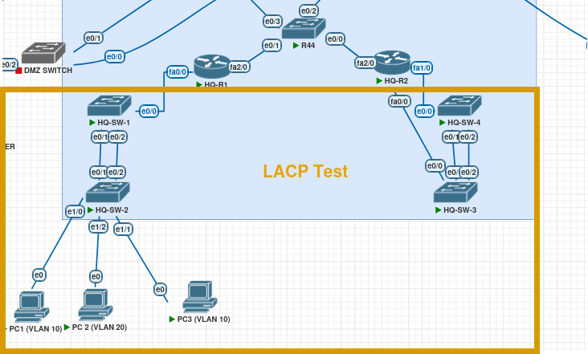
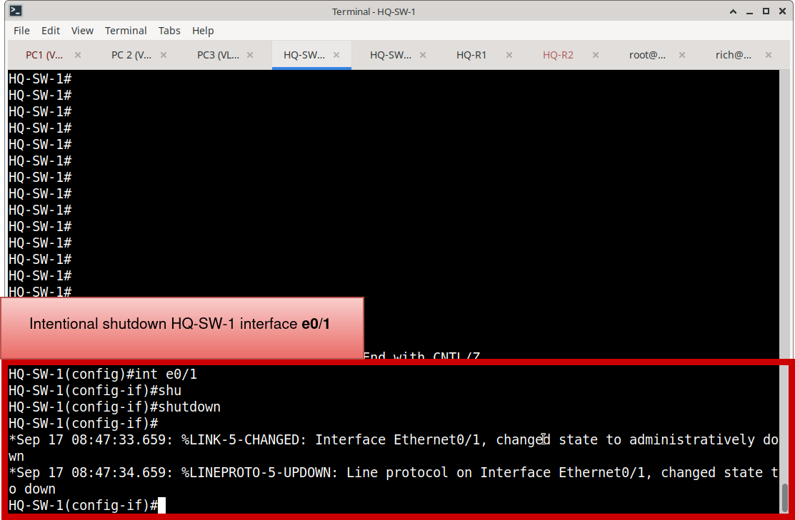
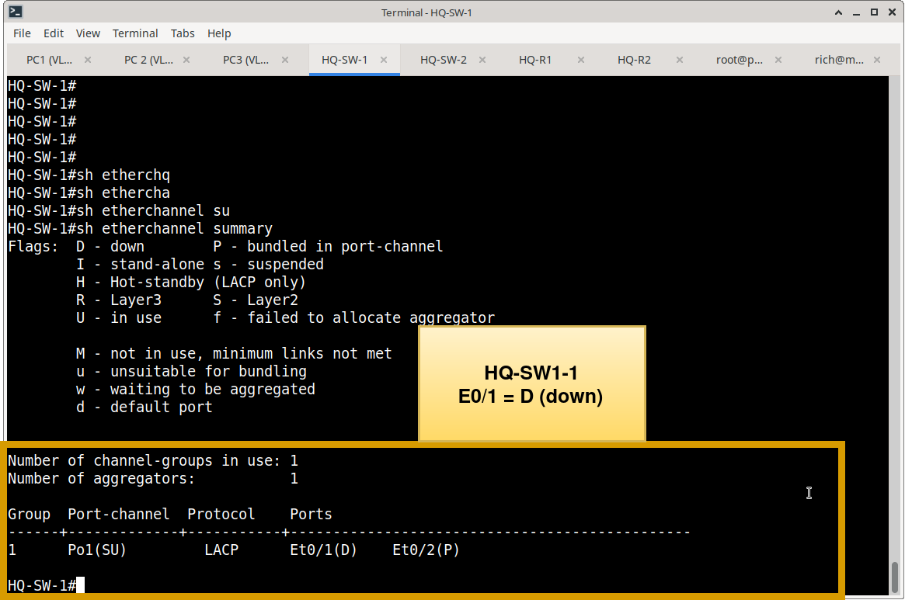
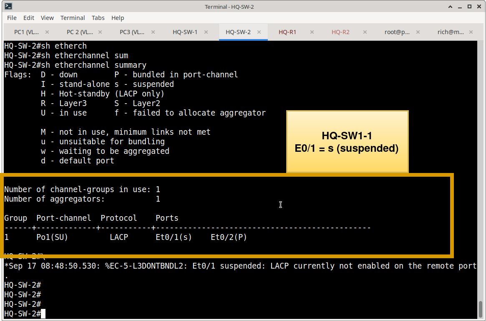
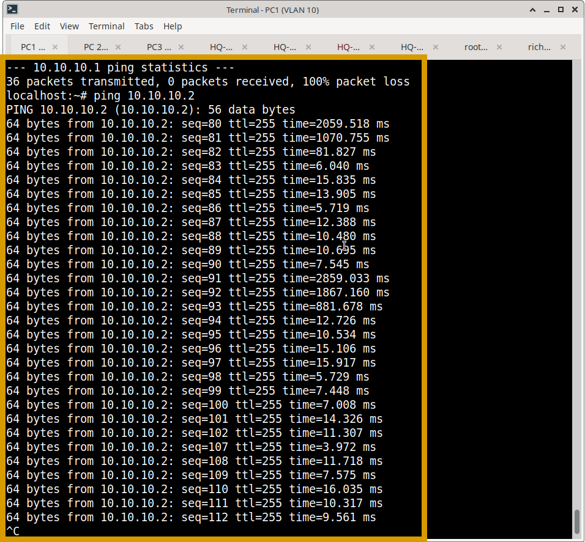

Here is the polished, portfolio-ready version of your LACP verification document. It follows the same professional, enterprise-validation structure as the VLAN and STP documents, transforming a simple command checklist into a compelling demonstration of network resiliency.

***

# LACP EtherChannel Operational Verification & Resiliency Testing

## Objective

Validate that Link Aggregation Control Protocol (LACP) EtherChannel bundles are operating correctly across the Meridian switching infrastructure. Verification ensures logical bandwidth aggregation, seamless link-level redundancy, and predictable failover behavior without disrupting active traffic flows.

---

## 1. Steady-State Operational Verification

The following commands were utilized to verify the health, negotiation, and operational state of the Layer 2 EtherChannel bundles.

| Verification Area | Command | Validation Criteria |
| :--- | :--- | :--- |
| **Bundle Status & Membership** | `show etherchannel summary` | • Port-channel is Layer 2 and in use: `Po1(SU)` • Protocol is correctly set to `LACP` • All intended physical member interfaces show the `(P)` flag (bundled and participating). |
| **Protocol Negotiation** | `show lacp neighbor` | • LACP adjacency is successfully established. • Partner System ID matches the expected peer switch. • Local and remote port states align (e.g., Active/Active negotiation). |
| **Logical Interface Health** | `show interfaces port-channel 1` | • Logical interface is `up/up`. • Bandwidth reflects the aggregate sum of active member links (e.g., 2 Gbps for two 1 Gbps links). • Input/output error counters remain at zero, indicating a clean physical layer. |

---

## 2. Functional Failure Testing (Resiliency)

A core benefit of LACP is N+1 link redundancy. Functional testing was performed to prove that the logical bundle survives the loss of a physical member link without dropping active sessions.

### Test Methodology
1. **Baseline State:** Verified all member links were active `(P)` and initiated a continuous ICMP ping stream across the EtherChannel.
2. **Failure Injection:** Intentionally shut down a single active member interface (e.g., `Ethernet0/1`) on the primary switch.
3. **Observation:** Monitored the continuous ping, LACP neighbor state, and Port-Channel summary during the failure window.
4. **Recovery:** Re-enabled the failed interface and verified LACP automatically renegotiated and re-bundled the link.

### Test Results
* **Zero Packet Loss:** The continuous ping stream experienced **0% packet loss** during the member link failure, proving sub-second traffic redistribution to the remaining active link(s).
* **Logical Stability:** The `Port-channel 1` interface state remained `up/up` throughout the entire test.
* **Automatic Recovery:** Upon re-enabling the physical interface, LACP successfully renegotiated, and the interface returned to the `(P)` bundled state without manual intervention.

**LACP Test Topology**

**HQ-SW-1 e0/1 intentional shutdown**

**HQ-SW-1 show etherchannel summary during failure**

**HQ-SW-1 show etherchannel summary during failure**

**PC1 unbroken ping during failure**

---

## 3. Evidence & Artifacts

### Operational Screenshots
Representative steady-state verification screenshots are stored in:
`Switching/Verification/EtherChannel-LACP/screenshots/`

**Recommended Evidence:**
* `hq-sw1-etherchannel-summary.png` *(Proves Po1(SU) state and (P) member bundling)*
* `hq-sw1-lacp-neighbor.png` *(Proves successful LACP adjacency and partner identification)*
* `hq-sw1-port-channel1.png` *(Proves logical interface is up/up with aggregated bandwidth)*

### Functional Test Evidence
The raw resiliency testing evidence, including the continuous ping success and intentional link failure states, is maintained in the project-level testing directory:
`LACP Testing/`

*Note: This directory references the functional test results but does not duplicate the raw screenshots to maintain documentation density.*

---

## Verification Conclusion

LACP verification confirms that all configured EtherChannel bundles are fully operational. The implementation successfully provides logical bandwidth aggregation and seamless link-level redundancy. Functional testing proves that single member-link failures are handled gracefully, maintaining uninterrupted Layer 2 connectivity as designed.
