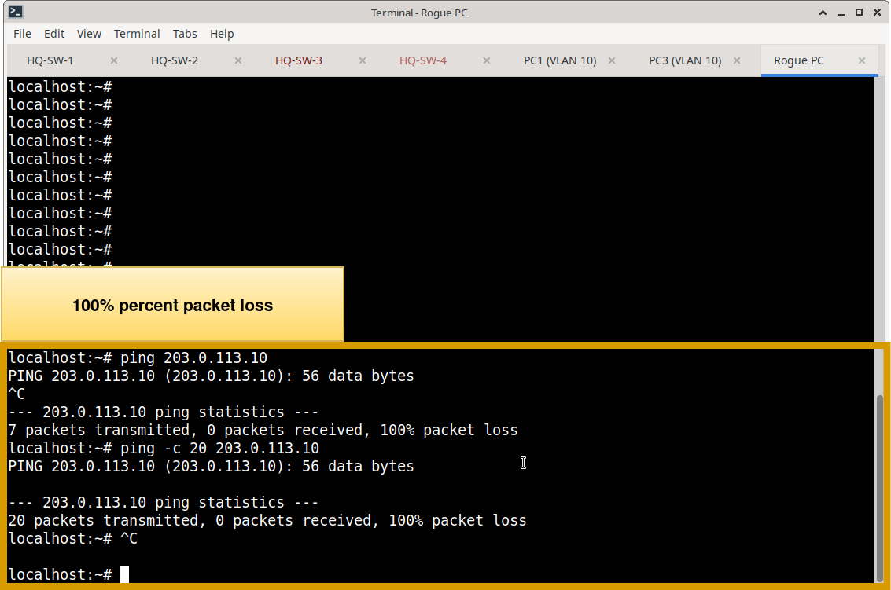
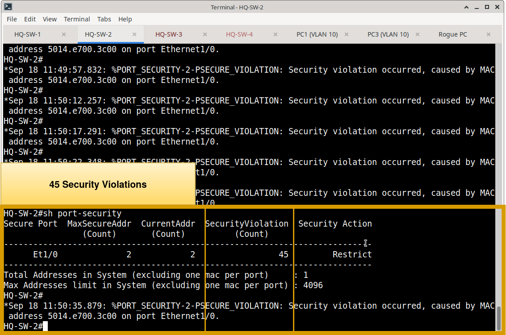
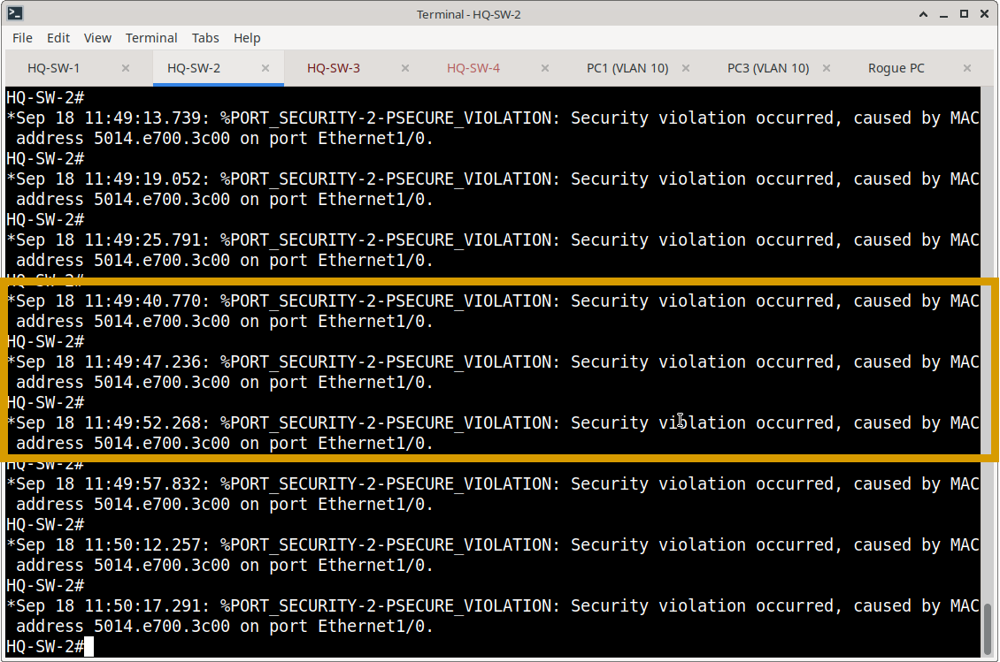

Here is the polished, portfolio-ready version of your Port Security verification document. It perfectly aligns with the structure and professional tone of the VLAN, STP, and LACP documents, transforming a simple command checklist into a formal access-control validation report.

***

# Port Security Operational Verification & Access Control Testing

## Objective

Validate that Port Security effectively enforces Layer 2 access control policies across the Meridian switching infrastructure. Verification ensures that authorized endpoints maintain connectivity while unauthorized MAC addresses are strictly blocked according to the configured violation modes (Restrict or Shutdown).

---

## 1. Steady-State Operational Verification

The following commands were utilized to verify the health and current state of the Port Security implementation.

| Verification Area | Command | Validation Criteria |
| :--- | :--- | :--- |
| **Global Port Security State** | `show port-security` | • Port Security is enabled on target interfaces. • Maximum allowed MAC addresses match the design. • Current secure MAC counts align with expectations. • Violation counters and modes are correctly displayed. |
| **Granular Interface State** | `show port-security interface [id]` | • Port status is `Secure-up` (or `Secure-down` if awaiting first MAC). • Violation mode is correctly set (`Restrict` or `Shutdown`). • Sticky MAC learning is active where configured. • Security violation count is at baseline (0 prior to testing). |
| **Secure MAC Binding** | `show port-security address` | • Authorized MAC addresses are correctly learned and bound. • MAC address type is listed as `SecureSticky`. • MAC addresses are mapped to the correct VLAN and physical interface. |

---

## 2. Functional Security Testing (Access Control)

Functional testing was performed to prove that the switch actively enforces the configured MAC address limits and responds appropriately to policy violations.

### Test Methodology
1. **Baseline Connectivity:** Verified that the authorized endpoint (e.g., PC1 on VLAN 10) could successfully communicate across the network.
2. **Violation Injection:** Connected an unauthorized "rogue" device to the protected switchport, introducing a new, unlearned MAC address.
3. **Observation:** Monitored the rogue device's connectivity, the switch's violation counters, and system logging (syslog) behavior.

### Test Results by Violation Mode
* **Restrict Mode (e.g., HQ-SW-2 Ethernet1/0):** 
  - The authorized endpoint maintained uninterrupted connectivity.
  - The rogue device's traffic was silently dropped (blackholed) at Layer 2.
  - The switch incremented the `Security Violation Count` and generated a syslog message, alerting administrators without disrupting the legitimate user.

**Port-Security Test Topology**

**HQ-SW-2 show port-security: maximum mac-addresses full**

**Rogue PC unable to communicate via ping**

**Security Violation Counter = 45**

`*Sep 18 11:49:13.739: %PORT_SECURITY-2-PSECURE_VIOLATION: Security violation occurred, caused by MAC address 5014.e700.3c00 on port Ethernet1/0.`

---

## 3. Evidence & Artifacts

### Operational Screenshots
Representative steady-state verification screenshots are stored in:
`Switching/Verification/Port-Security/screenshots/`

**Recommended Evidence:**
* `hq-sw2-show-port-security.png` *(Proves global port security summary and violation modes)*
* `hq-sw2-e1-0-port-security-detail.png` *(Proves granular interface state, sticky learning, and 0 violations at baseline)*
* `hq-sw2-show-port-security-address.png` *(Proves successful SecureSticky MAC binding to VLAN 10)*

### Functional Test Evidence
The raw security testing evidence, including rogue device packet loss, violation counter increments, and syslog generation, is maintained in the project-level testing directory:
`Port Security Test/`

*Note: This directory references the functional test results but does not duplicate the raw screenshots to maintain documentation density.*

---

## Verification Conclusion

Port Security verification confirms that the Layer 2 access control policy is successfully implemented and actively enforced. The switch correctly learns and binds authorized endpoint MAC addresses via sticky learning, while functional testing proves that unauthorized devices are effectively blocked. The use of "Restrict" mode ensures that security violations are logged and dropped without unnecessarily disrupting legitimate user productivity.

***
