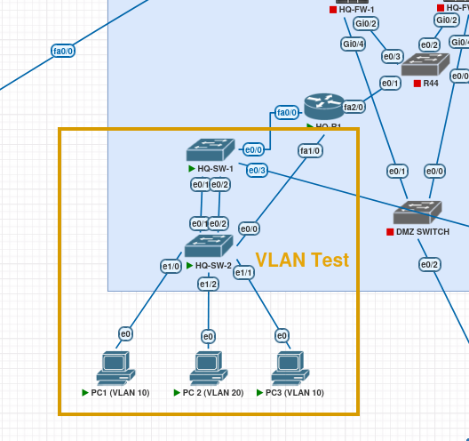
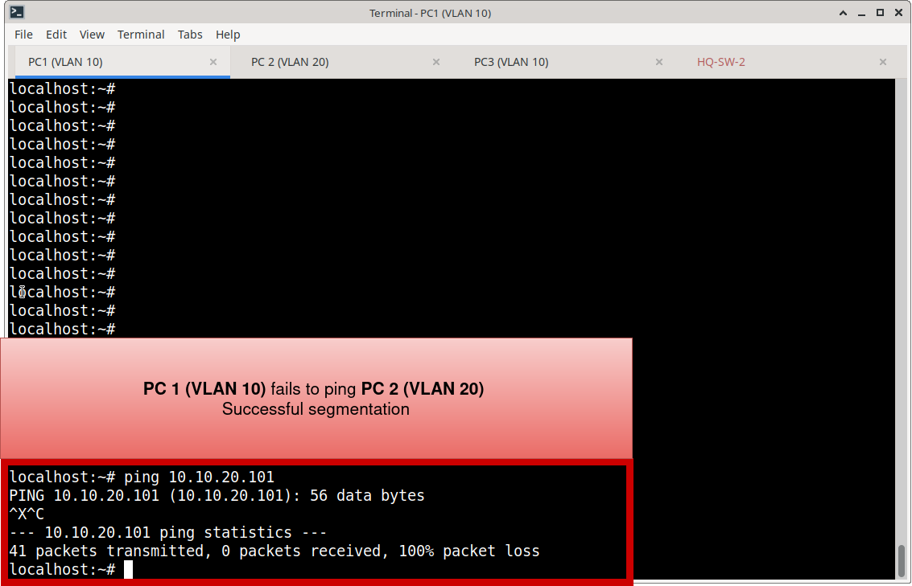

# VLAN Operational Verification & Validation

## Objective

Validate that the Meridian switching infrastructure correctly enforces Layer 2 segmentation. This document verifies VLAN database consistency, trunk negotiation, access port mapping, and strict inter-VLAN isolation.

---

## 1. Operational Verification (Steady State)

The following commands were utilized to verify the steady-state operational health of the VLAN implementation across the switching environment.

| Verification Area | Command | Validation Criteria |
| :--- | :--- | :--- |
| **VLAN Database & Access Mapping** | `show vlan brief` | • Expected VLANs exist in the database. • Access ports are mapped to the correct VLANs. • Unused ports are relegated to the designated unused/parking VLAN. |
| **Trunk Negotiation & Allow-listing** | `show interfaces trunk` | • Uplinks and distribution links successfully negotiate 802.1Q trunks. • Only required VLANs are permitted across the trunk. • Native VLAN configuration is consistent and secure. |
| **Granular Port State** | `show interfaces [id] switchport` | • Administrative mode matches design (Access/Trunk). • Operational mode matches Administrative mode (no mismatch errors). • Voice VLAN (if applicable) is correctly assigned. |

---

## 2. Functional Testing (Isolation & Connectivity)

Beyond operational state, functional testing was performed to prove that Layer 2 segmentation is actively enforced and that traffic flows correctly within boundaries.

### Test Methodology
1. **Intra-VLAN Connectivity:** Verified that endpoints within the same VLAN (e.g., VLAN 10) can successfully communicate (ping/ARP resolution).
2. **Inter-VLAN Isolation:** Verified that endpoints in different VLANs (e.g., VLAN 10 and VLAN 20) **cannot** communicate at Layer 2, proving the switch is correctly enforcing broadcast domain boundaries.

### Test Results
* **Same-VLAN Communication:** Successful. Endpoints successfully resolved ARP and passed ICMP traffic.
* **Cross-VLAN Communication:** Blocked. ICMP traffic between VLAN 10 and VLAN 20 failed at the Layer 2 boundary, confirming strict segmentation.

**VLAN Topology**

**Same-VLAN Ping**

**Inter-VLAN Ping**

---

## 3. Evidence & Artifacts

### Operational Screenshots
Representative operational verification screenshots are stored in:
`Switching/Verification/VLAN/screenshots/`

**Recommended Evidence:**
* `hq-sw1-show-vlan-brief.png` *(Proves VLAN database and port mapping)*
* `hq-sw1-show-interfaces-trunk.png` *(Proves trunk negotiation and native VLAN consistency)*
* `hq-sw1-e1-0-switchport-detail.png` *(Proves granular access port state)*
