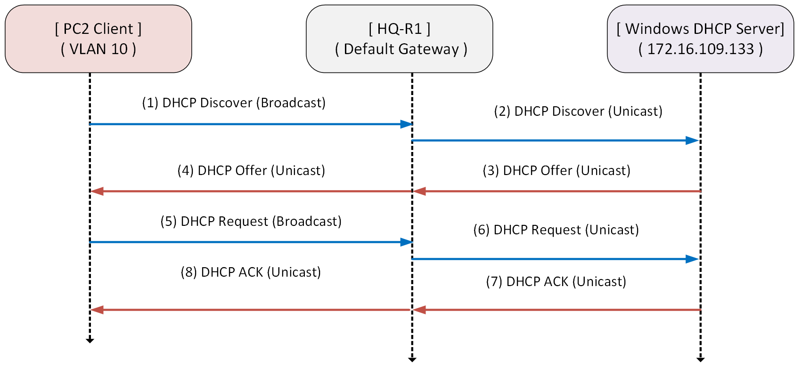
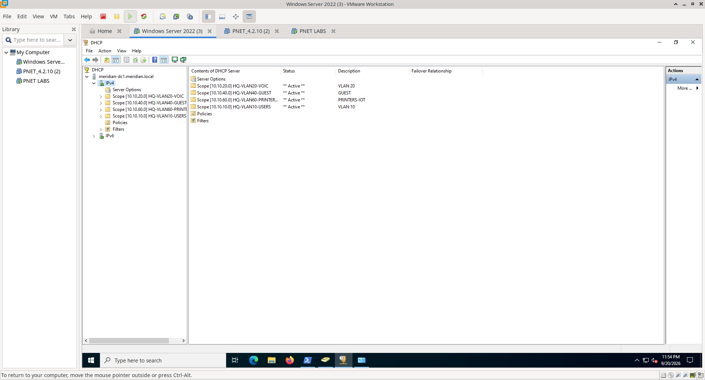
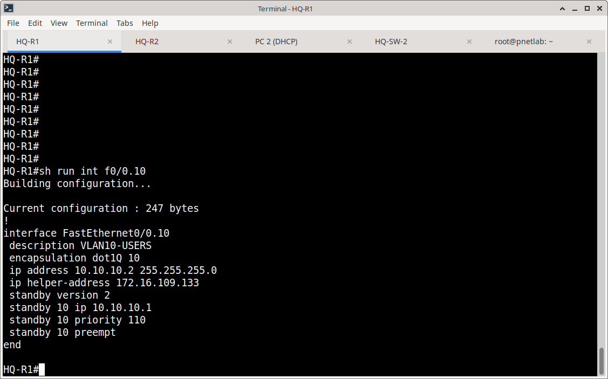
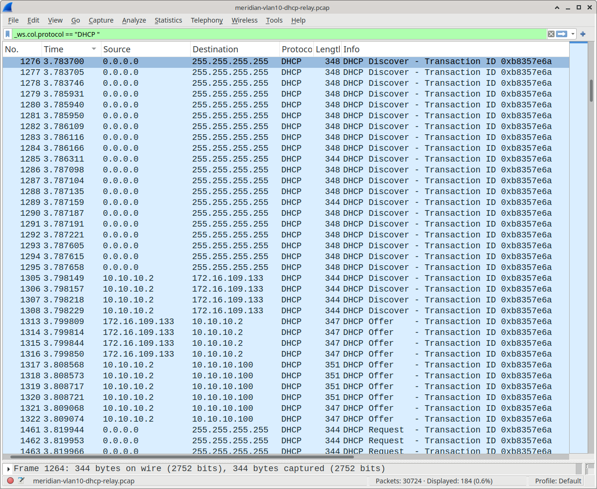
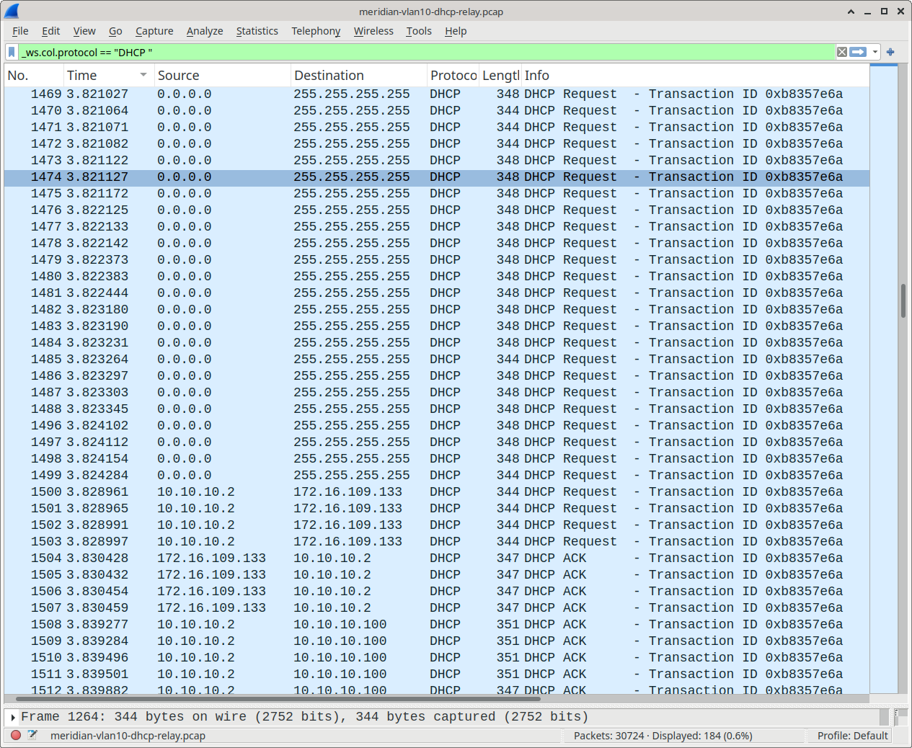

# Windows DHCP — Dynamic Address Management

## Overview

This section documents the Windows Server DHCP implementation within the Meridian Financial Services environment. DHCP provides automated IPv4 address assignment to network endpoints, eliminating manual IP configuration and ensuring consistent network parameters across the enterprise.

The implementation integrates with the Meridian routing infrastructure through DHCP relay (ip helper-address), enabling centralized DHCP services to serve multiple VLANs and subnets from a single Windows Server instance.

---

## Architecture

---

## Design Objectives

- **Centralized Address Management:** Single Windows DHCP server manages all scopes, simplifying administration and ensuring consistent IP allocation policies.
- **Cross-Subnet Service Delivery:** DHCP relay (ip helper-address) on HQ-R1 enables centralized DHCP to serve multiple VLANs without requiring a DHCP server in each broadcast domain.
- **Automated Network Configuration:** Clients receive not just an IP address, but complete network parameters (gateway, DNS, subnet mask) for immediate connectivity.
- **Lease Management:** Configurable lease durations balance address reuse efficiency with network stability.
- **Integration with DNS:** DHCP-assigned clients automatically receive DNS server addresses, enabling seamless name resolution upon network attachment.

---

## Implementation Scope

### Server-Side Configuration
- Windows DHCP role installation and authorization
- Scope creation for Meridian VLANs (10.10.10.0/24, etc.)
- Address pool configuration and exclusion ranges
- Scope options (Router/Default Gateway, DNS Servers)
- Active lease monitoring and management

### Network Infrastructure Integration
- HQ-R1 configured with `ip helper-address` on client-facing interfaces
- DHCP relay forwards broadcast requests as unicast to Windows DHCP server
- IPsec tunnel connectivity verified for remote site DHCP relay (if applicable)

### Client-Side Validation
- DHCP client initiates DORA process (Discover, Offer, Request, Acknowledge)
- Client receives and applies IP configuration
- Default gateway and DNS servers correctly assigned
- Network connectivity verified post-DHCP
- DNS resolution tested (nslookup)

**Discover / Offer**

**Request / ACK**

---

## Verification Strategy

The DHCP implementation was validated through a three-tier approach:

1. **Configuration Verification:** Confirming DHCP scopes, pools, and relay configuration are correctly deployed.
2. **Protocol-Level Verification:** Packet capture (Wireshark) of the complete DORA exchange to prove the DHCP handshake succeeds.
3. **Functional Verification:** Client successfully obtains IP, gateway, DNS, and achieves network connectivity with DNS resolution.

---

## Documentation Structure

| Document | Purpose |
| :--- | :--- |
| `README.md` | Architecture, design objectives, and verification strategy. |
| `configuration.md` | Implementation details, relay configuration, and evidence matrix. |
| `screenshots/` | Curated evidence of DHCP server config, DORA capture, and client validation. |

---

## Related Documentation

- **DNS & GPO:** `Windows/02-DNS-GPO/` (DNS server configuration and Group Policy)
- **Network Infrastructure:** `Switching/` and `Routing/` (VLAN and routing configuration)
- **Firewall/IPsec:** `Azure/03-Site-to-Site-VPN/` (VPN connectivity for remote DHCP relay)
