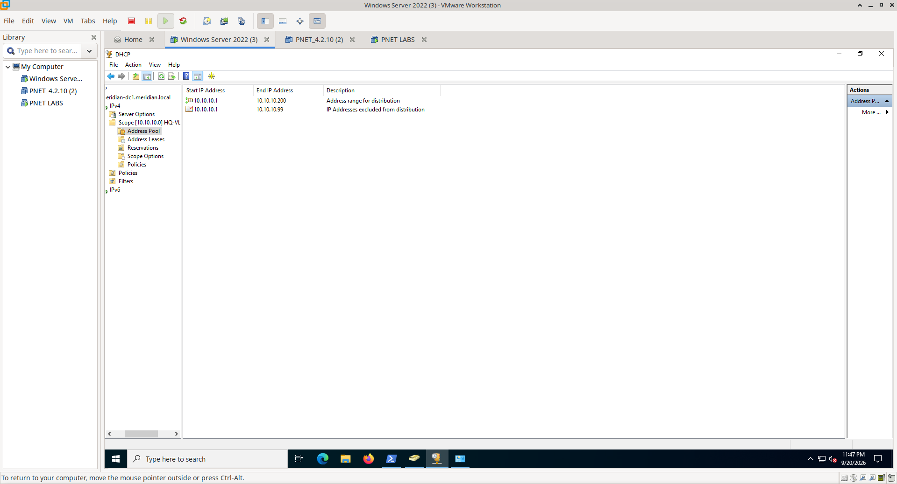
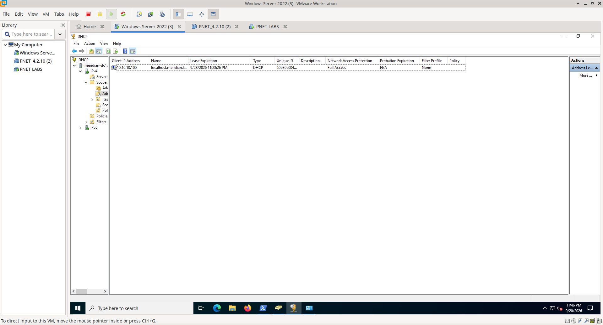
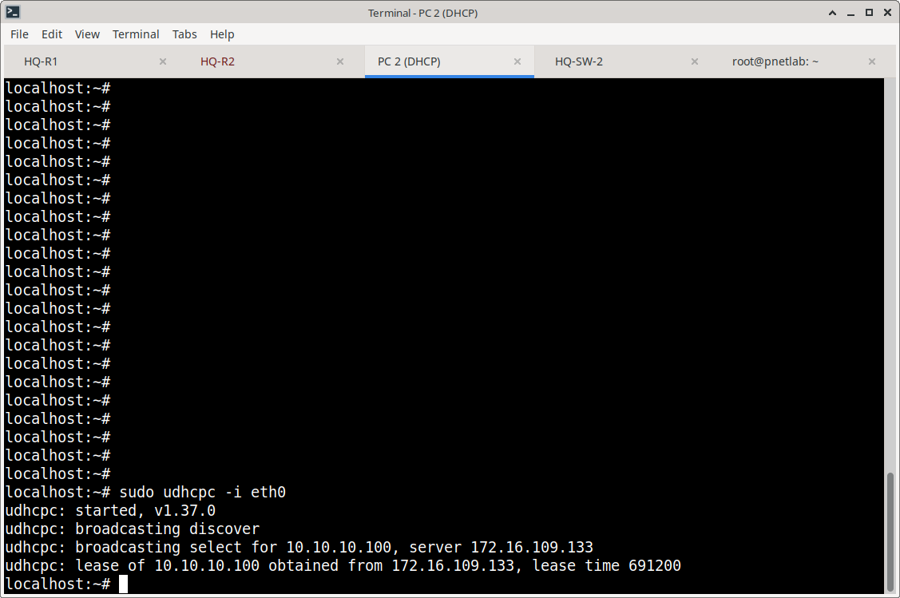
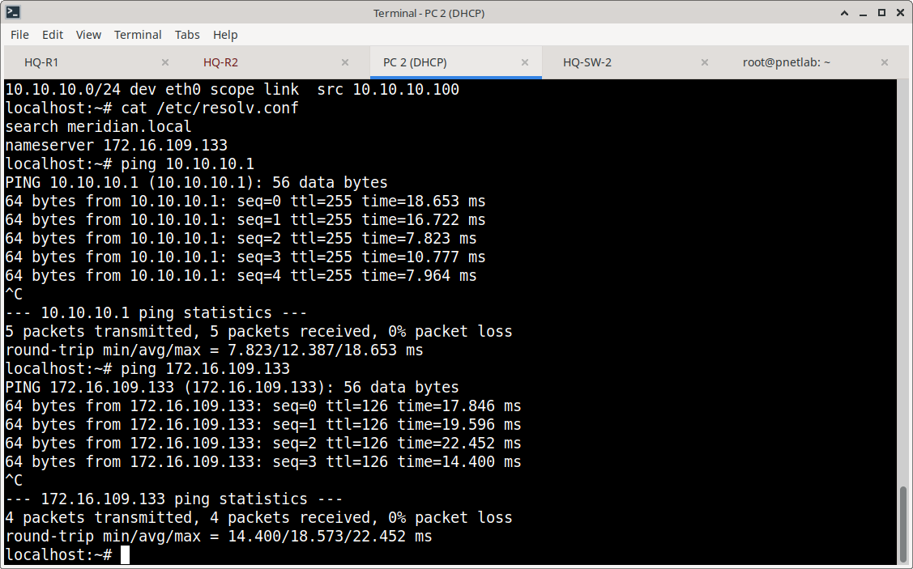
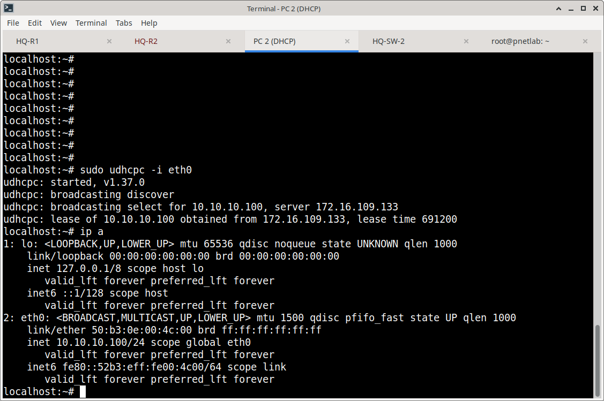
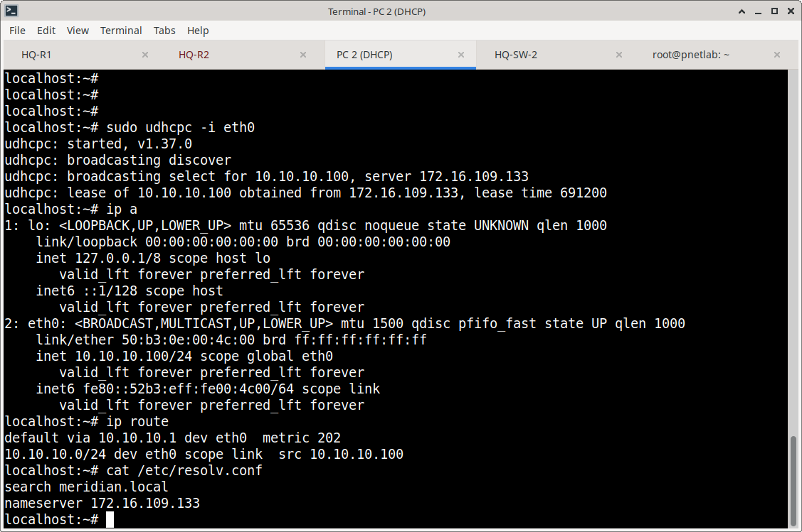
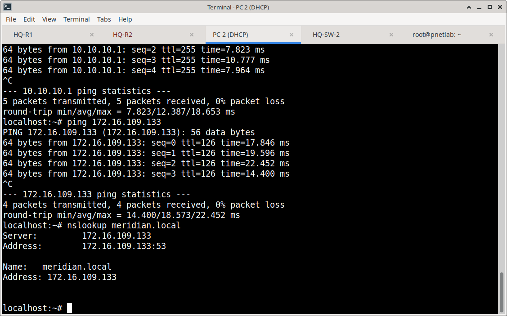

# Windows DHCP — Implementation & Validation

## Overview

This document details the Windows DHCP implementation within the Meridian environment, covering server-side scope configuration, network infrastructure relay integration, and comprehensive client-side validation through packet capture and functional testing.

---

## 1. Windows DHCP Server Configuration

### 1.1 Scope Management
The Windows DHCP server hosts multiple scopes corresponding to Meridian VLANs. Each scope defines:
- **Address Range:** Available IP addresses for dynamic assignment
- **Subnet Mask:** Network boundary for the scope
- **Lease Duration:** Time before address renewal is required
- **Scope Options:** Default gateway (Router), DNS servers, and other parameters


### 1.2 Address Pool Configuration
Within each scope, the address pool defines the specific range of IPs available for assignment. Exclusion ranges can be configured to reserve specific addresses for static devices.



### 1.3 Active Lease Monitoring
After successful client assignment, the DHCP server maintains an active lease record showing:
- Client MAC address
- Assigned IP address
- Lease expiration time
- Lease state (Active)





---

## 2. Network Infrastructure Integration (DHCP Relay)

### 2.1 The Relay Challenge
DHCP clients initially broadcast DHCP Discover messages (destination 255.255.255.255). Broadcasts do not cross router boundaries, so a DHCP server on a different subnet cannot receive client requests directly.

### 2.2 IP Helper Configuration
HQ-R1 solves this through the `ip helper-address` command, which:
- Intercepts DHCP broadcast messages (UDP port 67)
- Converts them to unicast packets
- Forwards them to the specified DHCP server IP (172.16.109.133)
- Maintains transaction IDs to match responses to the correct client

**Configuration Example:**
```cisco
interface FastEthernet0/0.10
 encapsulation dot1Q 10
 ip address 10.10.10.2 255.255.255.0
 ip helper-address 172.16.109.133  ! Forward DHCP to Windows Server
```
---

## 3. Client-Side Validation

### 3.1 Network Connectivity Baseline
Before DHCP testing, baseline connectivity between the client network and DHCP server was verified.



### 3.2 DHCP Request Packet Capture
A packet capture was initiated on the client to observe the DHCP transaction at the protocol level. The capture shows the client broadcasting a DHCP Discover message requesting an IP address.

---

## 4. DORA Process Verification (Wireshark Analysis)

The complete DHCP transaction follows the **DORA** process:

```text
Step 1: DISCOVER  →  Client broadcasts DHCP Discover (src: 0.0.0.0, dst: 255.255.255.255)
Step 2: OFFER     →  Server responds with DHCP Offer (proposed IP, gateway, DNS)
Step 3: REQUEST   →  Client broadcasts DHCP Request (accepting the offer)
Step 4: ACK       →  Server sends DHCP ACK (finalizing the lease)
```

**Wireshark Evidence:**
The packet capture shows all four DORA messages with correct transaction IDs, confirming the complete DHCP handshake succeeded.

**Discover / Offer**


**Request / ACK**


**Raw Packet Capture:**

For detailed protocol analysis, the raw packet capture from this test is available for download:
[ Download dhcp.pcap](pcaps/dhcp.pcap)

---

## 5. Post-DHCP Client Configuration

### 5.1 IP Address Assignment
After DORA completion, the client applies the assigned IP configuration. Verification confirms:
- IP address matches DHCP scope range
- Subnet mask is correct
- Interface state is UP



### 5.2 Default Gateway Configuration
The client receives the default gateway address via DHCP Option 3 (Router). This enables the client to route traffic beyond its local subnet.


### 5.3 Successful DHCP Assignment Confirmation
Windows network configuration confirms the interface obtained its address via DHCP (not static), with all parameters correctly applied.


---

## 6. DNS Integration Validation

### 6.1 DNS Server Assignment
DHCP Option 6 provides DNS server addresses to the client. The client's DNS configuration is verified to ensure it points to the Meridian DNS server.



### 6.2 DNS Resolution Testing
With DNS servers configured, the client performs name resolution against the Meridian server, confirming end-to-end network functionality.



---

## 7. Evidence Matrix

| Verification Stage | Evidence File | What It Proves |
| :--- | :--- | :--- |
| **Server Configuration** | `01-windows-dhcp-total-scopes.png` | DHCP scopes created for Meridian VLANs |
| | `02-windows-dhcp-address-pool.png` | Address pool range configured correctly |
| | `03-windows-dhcp-active-lease.png` | Server issued lease to client |
| **Network Infrastructure** | `04-hq-r1-dhcp-helper.png` | IP helper-address configured on HQ-R1 |
| | `05-hq-firewall-ipsec-sa.png` | IPsec tunnel active for remote relay |
| **Client Testing** | `06-pc1-connectivity-test.png` | Baseline network connectivity verified |
| | `07-pc2-dhcp-request-pcap.png` | Client initiated DHCP Discover |
| **Protocol Validation** | `08-wireshark-successful-dora.png` | Complete DORA exchange captured |
| **Post-DHCP Validation** | `09-pc2-dhcp-address.png` | Client received correct IP address |
| | `10-pc2-default-gateway.png` | Default gateway assigned via DHCP |
| | `11-pc2-dhcp-success.png` | Windows confirms DHCP assignment |
| **DNS Integration** | `12-pc2-dns-configuration.png` | DNS servers received via DHCP |
| | `13-pc-nslookup-meridian-server.png` | DNS resolution functional |

---

## 8. Complete DHCP Workflow


---

## 9. Scope & Boundaries

This section documents **Windows DHCP implementation and client validation**.

**Not covered here:**
- DNS server configuration (covered in `02-DNS-GPO/`)
- Group Policy for DNS client settings (covered in `02-DNS-GPO/`)
- IPsec VPN configuration (covered in `Azure/03-Site-to-Site-VPN/`)
- Switching/VLAN configuration (covered in `Switching/`)

---

## Related Documentation

- **DNS & GPO:** `Windows/02-DNS-GPO/`
- **Network Infrastructure:** `Switching/` and `Routing/`
- **VPN/IPsec:** `Azure/03-Site-to-Site-VPN/`
