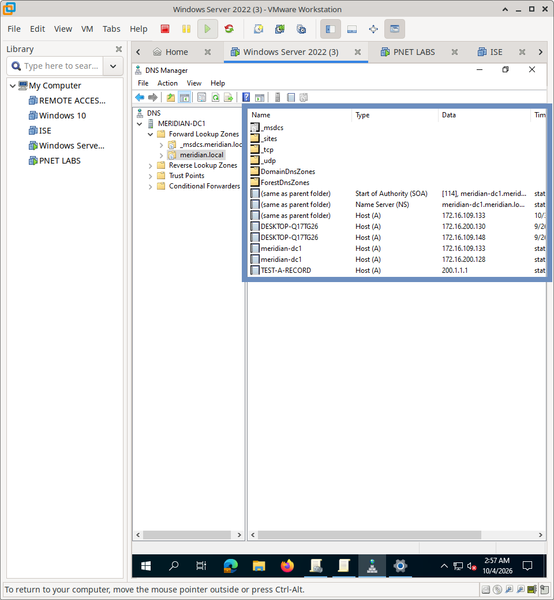
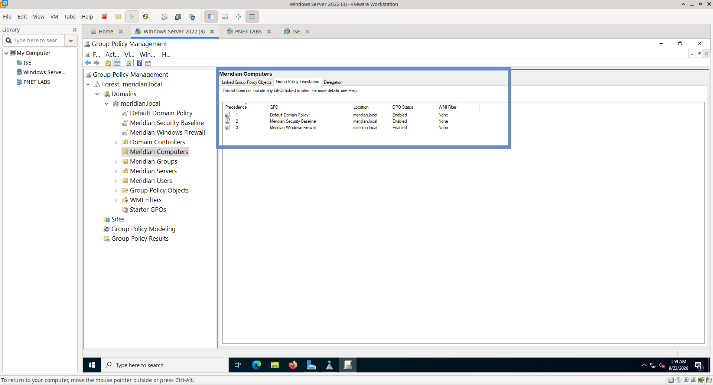
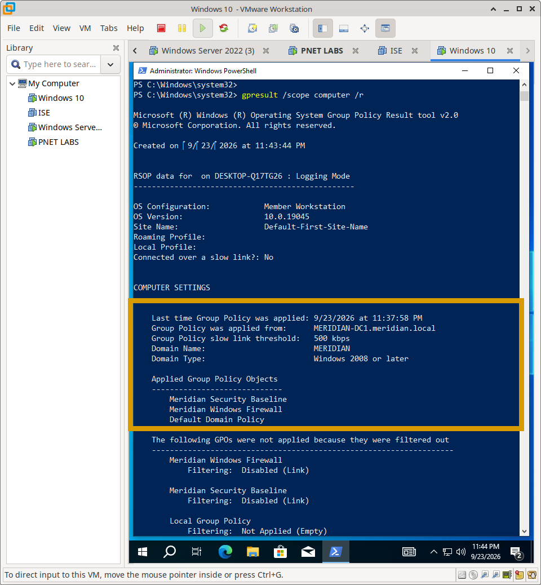

# Windows DNS & Group Policy Management

## Overview

This section documents the implementation of Windows DNS and Group Policy Object (GPO) within the Meridian Financial Services Active Directory environment. 

DNS provides the foundational name resolution required for Active Directory functionality and general network communication, while Group Policy provides centralized, automated configuration and security management for all domain-joined endpoints.

---

## Architecture

---

## Design Objectives

- **Reliable Name Resolution:** Implement robust Forward and Reverse DNS lookup zones to ensure seamless communication between Windows and Linux endpoints.
- **Centralized Security Management:** Utilize Group Policy to enforce a unified Meridian Security Baseline across all domain-joined devices, eliminating local configuration drift.
- **Network Visibility & Control:** Deploy standardized Windows Defender Firewall rules via GPO, including controlled ICMP allowances for the `10.0.0.0/8` management network.
- **Identity Protection:** Enforce strong password complexity and account lockout policies to protect against brute-force and credential-stuffing attacks.

**DNS**

**GPO**

---

## Implementation Scope

### 1. DNS Infrastructure
- Forward and Reverse Lookup Zone configuration.
- PTR Record management for reverse resolution.
- Cross-platform client validation (Windows 10 and Alpine Linux).

### 2. Group Policy & Security Baselines
- **Network Security:** Windows Defender Firewall rules and ICMP allowances.
- **Account Security:** Password complexity requirements (minimum length, character types).
- **Account Protection:** Account lockout thresholds to mitigate brute-force attacks.
- **Client Enforcement:** Verification of policy application via PowerShell (`gpresult`).

---

## Documentation Structure

| Document | Purpose |
| :--- | :--- |
| `README.md` | Architecture, design objectives, and implementation scope. |
| `configuration.md` | Implementation details, security baselines, and evidence matrix. |
| `screenshots/` | Curated evidence of DNS resolution, GPO application, and security testing. |

---

## Related Documentation

- **Dynamic Addressing:** `Windows/01-DHCP/`
- **File Access Control:** `Windows/03-File-Shares/`
- **Audit & Compliance:** `Windows/04-Logging-SIEM/`
