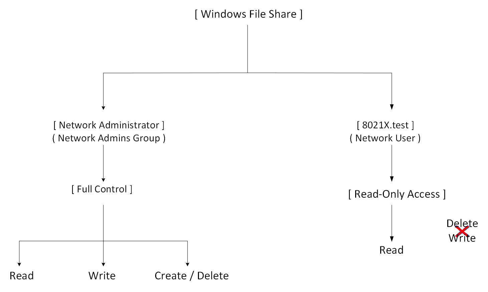
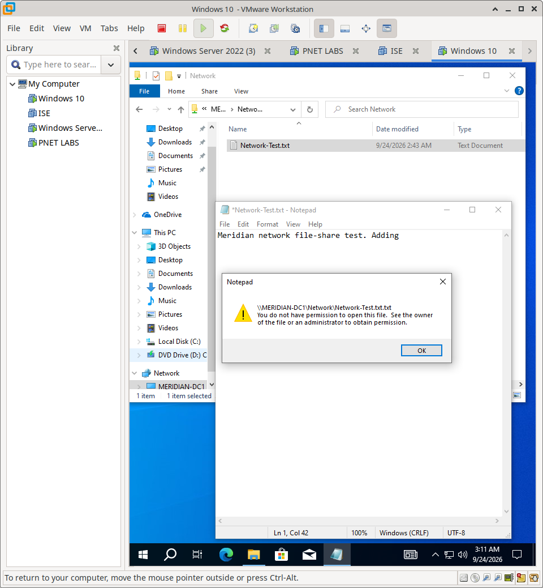

# Windows File Shares & Role-Based Access Control

## Overview

This section documents the implementation of Windows File Sharing and NTFS permissions within the Meridian Financial Services environment. 

The implementation enforces **Role-Based Access Control (RBAC)** and the **Principle of Least Privilege** by differentiating access levels based on the authenticated user's identity. Specifically, it demonstrates how Network Administrators are granted full management capabilities, while standard 802.1X Network Users are restricted to read-only access.

---

## Architecture & Access Model

The file share access model relies on Windows authentication and NTFS permission evaluation:

---

## Design Objectives

- **Centralized Data Storage:** Provide a unified, manageable location for shared enterprise resources.
- **Principle of Least Privilege:** Ensure users only have the minimum permissions required to perform their job functions (e.g., read-only for standard users).
- **Role-Based Enforcement:** Leverage Windows security groups and NTFS permissions to automatically apply access controls based on user identity.
- **Auditability:** Clearly define and test both positive (allowed) and negative (denied) access scenarios to prove policy enforcement.

---

## Implementation Scope

### Permission Configuration
- Windows Share creation and basic share-level permissions.
- Granular NTFS permissions applied to the target directory.
- Identity mapping for "Network Administrators" and "802.1X Network Users".

### Functional Validation
- **Positive Testing (Admin):** Verification of Read, Write, Create, and Delete operations.
- **Negative Testing (User):** Verification that Read succeeds, but Write and Create operations are explicitly denied by the OS.

---

## Documentation Structure

| Document | Purpose |
| :--- | :--- |
| `README.md` | Architecture, design objectives, and access model. |
| `configuration.md` | NTFS configuration, testing methodology, and evidence. |
| `screenshots/` | Curated evidence of permission settings and functional access tests. |

---

## Scope & Boundaries

This section documents **Windows File Share and NTFS permission enforcement**. 

It utilizes an identity that was previously authenticated via 802.1X to demonstrate end-to-end identity continuity, but the *802.1X network authentication configuration itself* is documented separately under `Cisco-ISE/02-802.1X/`.
