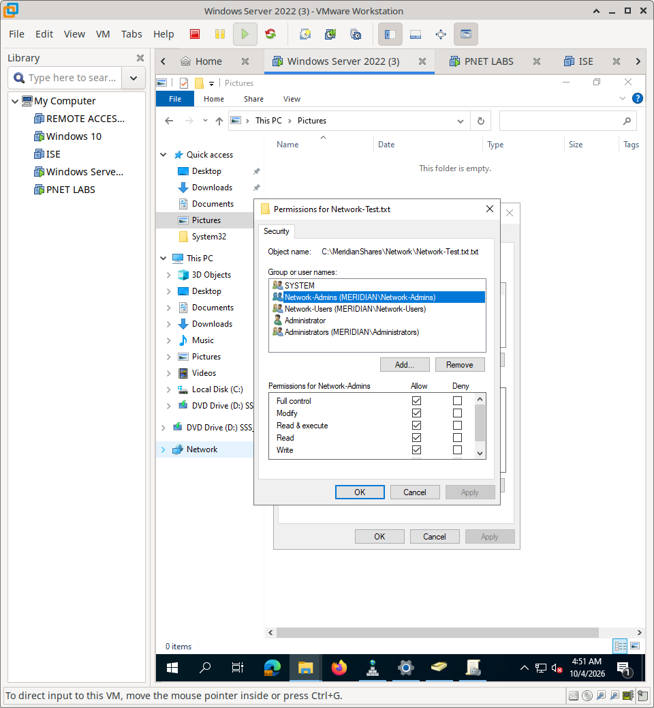
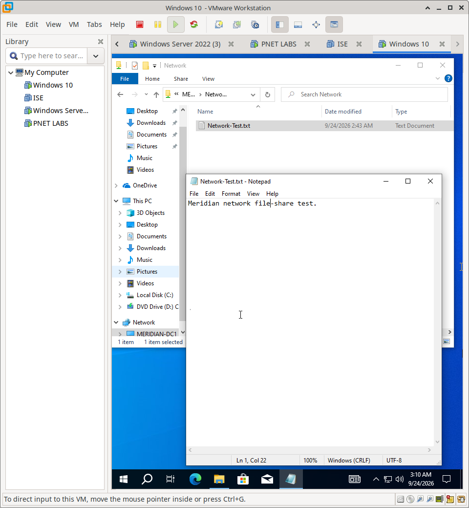

# Windows File Shares — Implementation & Validation

## Overview

This document details the configuration of Windows File Shares and the rigorous functional testing performed to validate Role-Based Access Control (RBAC) via NTFS permissions in the Meridian environment.

---

## 1. File Share & NTFS Configuration

To enforce granular access control, permissions are evaluated at the NTFS level. 

### 1.1 Share Configuration
A dedicated file share was created to host Meridian network resources. Share-level permissions were configured to allow baseline access, delegating the actual access control to NTFS.

### 1.2 NTFS Permissions
Granular NTFS permissions were applied to the folder. This ensures that even if a user bypasses the network share, the underlying file system enforces the security boundary.

---

## 2. Identity Mapping

Access is dictated by the authenticated Windows identity. Two distinct identities were used for validation:

1. **Network Administrator:** A privileged account granted Full Control/Modify rights.
   
   
   
2. **802.1X Network User:** A standard domain account granted Read & Execute rights.
   
   

---

## 3. Functional Validation: Network Administrator

The administrator account was tested to verify full management capabilities.

- **Write/Modify:** Successfully edited an existing file.
  
  **Please enlarge for clearer video**
  
- **Create/Delete:** Successfully created a new file and subsequently deleted it.
  
  **Please enlarge for clearer video**

**Result:** Administrative access controls are functioning as designed.

---

## 4. Functional Validation: 802.1X Network User (Negative Testing)

Negative testing is critical to prove that permissions are actively enforced, not just configured. The standard user account was tested against the same share.

- **Read:** Successfully opened and read a file from the share.
  
  
  
- **Write:** Attempted to modify the file. The OS explicitly denied the action.
  
  **Please enlarge for clearer video**
  
  
  
- **Create:** Attempted to create a new file in the directory. The OS explicitly denied the action.
  
  

**Result:** The Principle of Least Privilege is successfully enforced.

---

## 5. Evidence

| Verification Stage | Evidence File | What It Proves |
| :--- | :--- | :--- |
| **Architecture & Config** | `file-share-visio.png` | File share architecture and access model diagram. |
| | `nfts-permissions.png` | Granular NTFS permissions configured correctly. |
| | `network-admin-shares.png` | Share-level permissions established (Admin context). |
| | `network-user-share.png` | Share-level permissions established (User context). |
| **Admin Validation (Positive)** | `write-privilege.mp4` | Video proof of admin write/modify privileges. |
| | `share-permissions.gif` | Animated proof of admin share access/permissions. |
| | `creating-file.mp4` | Video proof of admin successfully creating a file. |
| **User Validation (Read Access)** | `read-successful.png` | Standard user can successfully read files. |
| **User Validation (Negative)** | `unable-to-write.png` | Standard user write attempts are blocked (Screenshot). |
| | `write-denied-screenshot.png` | Additional screenshot of write denial. |
| | `write-denied.mp4` | Video proof of standard user write attempts being blocked. |
| | `unable-to-create.png` | Standard user create attempts are blocked. |

---

## 6. Identity Continuity Note

The "802.1X Network User" referenced in this testing is the same identity authenticated by Cisco ISE in the `02-802.1X/` module. This demonstrates **identity continuity**: a user authenticates to the network via 802.1X, receives a VLAN assignment, and then seamlessly uses those same Windows domain credentials to access file shares with permissions dictated by Active Directory group membership.

---

## 7. Scope & Boundaries

This section documents **Windows File Share and NTFS permission enforcement**.

**Not covered here:**
- 802.1X Network Access Control configuration (covered in `Cisco-ISE/02-802.1X/`)
- Active Directory Group Policy creation (covered in `Windows/02-DNS-GPO/`)
