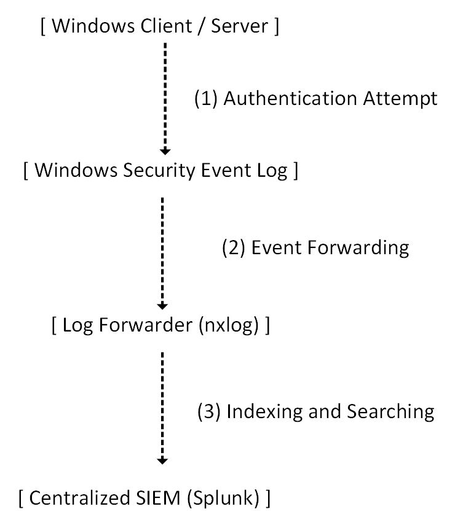

# Windows Logging & SIEM Visibility

## Overview

This section documents the implementation of Windows Security Event Auditing and centralized log visibility via Splunk within the Meridian Financial Services environment.

To maintain security compliance and enable effective incident response, it is critical to capture authentication-related activity (both successful and failed) at the endpoint level and aggregate it into a centralized Security Information and Event Management (SIEM) platform. 

This implementation focuses on configuring Windows Advanced Audit Policy, generating controlled authentication events (including account lockouts), and verifying their ingestion and visibility within Splunk.

---

## Architecture

The logging workflow ensures that local Windows events are reliably forwarded to the centralized SIEM:

---

## Design Objectives

- **Comprehensive Auditing:** Enable Advanced Audit Policy to capture logon/logoff events, including failures, which are critical for detecting brute-force attacks.
- **Account Lockout Visibility:** Ensure that account lockout events (Event ID 4740) are explicitly logged and visible for security monitoring.
- **Centralized Aggregation:** Validate that Windows Event Logs are successfully ingested into Splunk, providing a single pane of glass for security analysts.
- **Controlled Validation:** Use deliberate positive (valid credentials) and negative (invalid credentials) testing to prove the logging pipeline functions as designed.

---

## Implementation Scope

### Windows Endpoint Configuration
- Advanced Audit Policy configuration for Logon/Logoff events.
- Specific enabling of "Audit Failed Logon" and "Audit Account Lockout".

### Functional Testing
- Generation of successful logon events.
- Generation of failed logon events (intentional wrong password).
- Triggering of an account lockout event.

### SIEM Validation
- Verification of Event ID 4624 (Successful Logon) in Splunk.
- Verification of Event ID 4625 (Failed Logon) in Splunk.
- Verification of Event ID 4740 (Account Locked Out) in Splunk.

---

## Documentation Structure

| Document | Purpose |
| :--- | :--- |
| `README.md` | Architecture, design objectives, and implementation scope. |
| `configuration.md` | Audit policy settings, testing methodology, and evidence matrix. |
| `screenshots/` | Curated evidence of Windows Event Viewer logs and Splunk search results. |

---

## Scope & Boundaries

This section documents **Windows Security Auditing and basic Splunk log visibility**. 

It demonstrates the successful ingestion and searching of Windows authentication events. It does not cover advanced SIEM capabilities such as custom correlation rules, automated alerting workflows, or dashboard creation, which are outside the scope of this specific validation.

---

## Related Documentation

- **Account Security Policies:** `Windows/02-DNS-GPO/` (Password complexity and lockout thresholds)
- **Network Access Control:** `Cisco-ISE/02-802.1X/` (Source of authentication requests)
