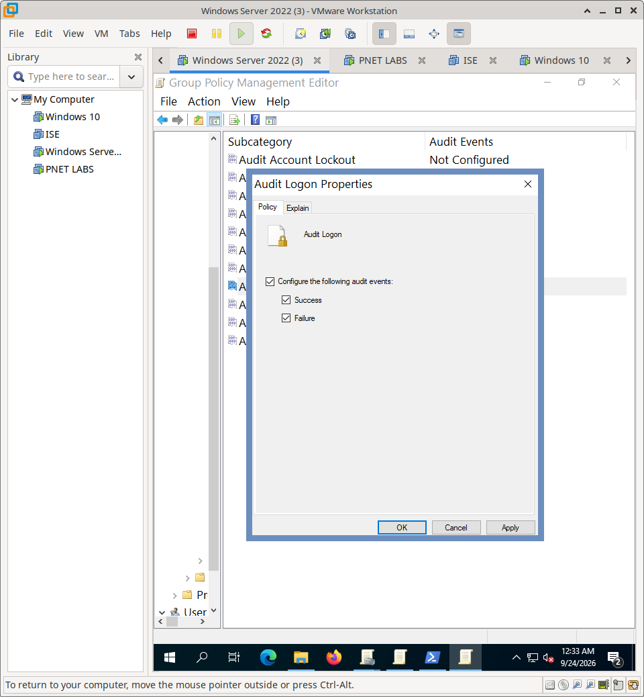
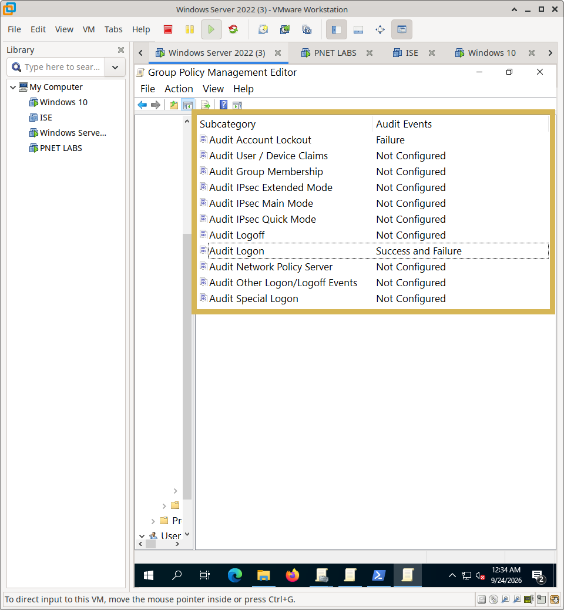
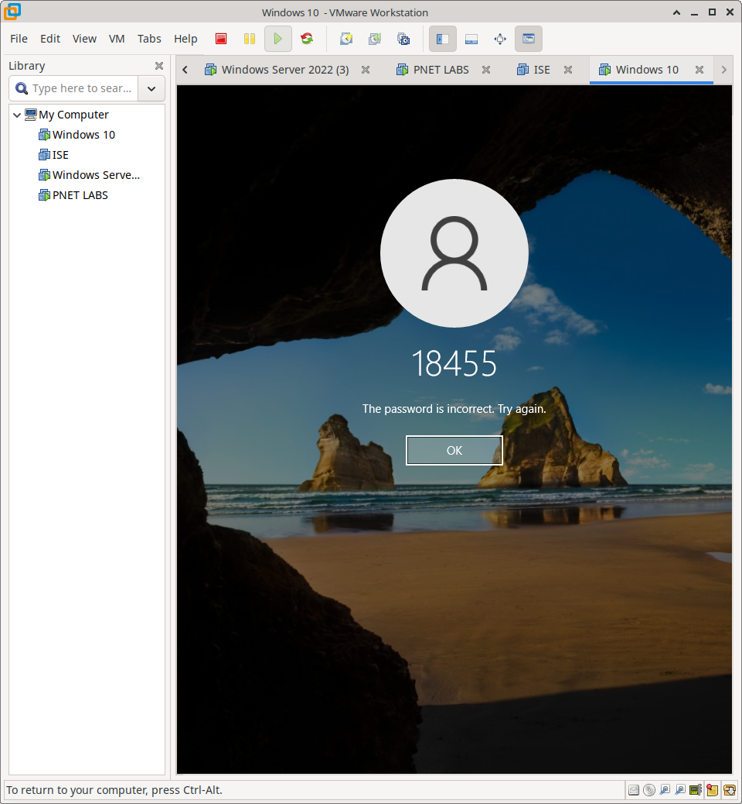
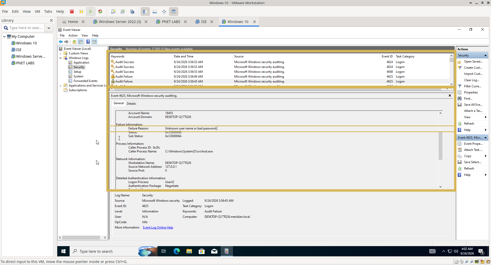
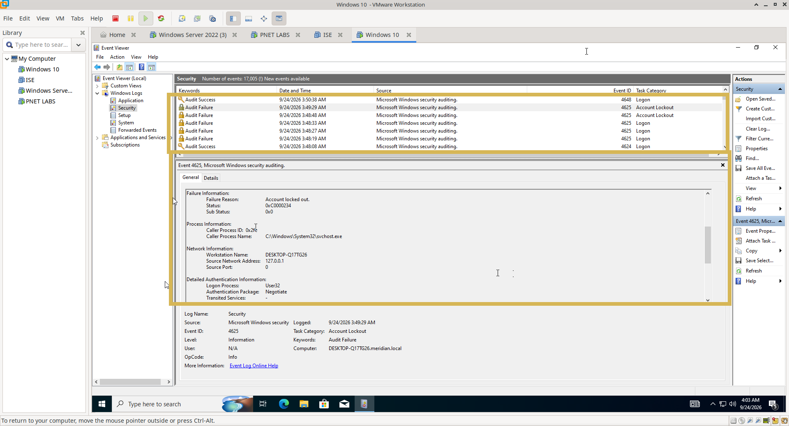
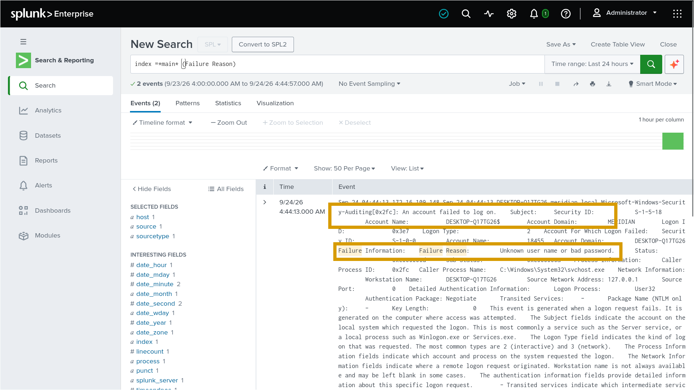
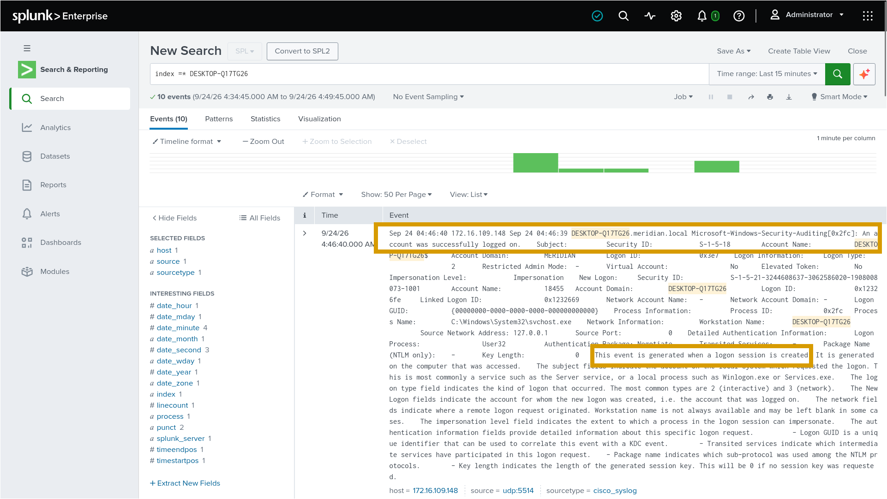

# Windows Logging & SIEM — Implementation & Validation

## Overview

This document details the configuration of Windows Advanced Audit Policies and the subsequent validation of log ingestion into Splunk. It proves that authentication events are correctly captured at the source and made visible to security operations.

---

## 1. Windows Audit Policy Configuration

To ensure security events are generated, the local security policy (or Group Policy) must be configured to audit specific actions.

**Configuration:**
Advanced Audit Policy was configured to track Logon/Logoff events, with specific emphasis on capturing failures.

---

## 2. Controlled Event Generation (Functional Testing)

To validate the auditing configuration, deliberate authentication attempts were performed.

### 2.1 Failed Authentication & Lockout
An intentionally incorrect password was entered multiple times to trigger a failed logon event and subsequently reach the account lockout threshold.

### 2.2 Successful Authentication
A valid credential was used to generate a baseline successful logon event for comparison.

---

## 3. Windows Event Log Verification

Before checking the SIEM, the local Windows Event Viewer was inspected to confirm the events were generated correctly.

- **Failed Logon (Event ID 4625):** Confirms the system rejected the invalid credential.
  
  
  
- **Successful Logon (Event ID 4624):** Confirms the system accepted the valid credential.
  
  
  
- **Account Lockout (Event ID 4740):** Confirms the system locked the account after repeated failures.
  
  

---

## 4. Splunk SIEM Visibility Validation

The ultimate goal is centralized visibility. The Windows logs were verified within the Splunk search interface to ensure successful ingestion.

### 4.1 Successful Logon in Splunk
A Splunk search was executed to locate the successful and failed authentication events, confirming the Windows log was forwarded and indexed correctly.

**Successful log**

**Failed log**

### 4.2 General Windows Log Visibility
A broader search confirms that Windows security events are consistently appearing in the Splunk index, providing the foundation for security monitoring.

---

## 5. Evidence Matrix

| Verification Stage | Evidence File | What It Proves |
| :--- | :--- | :--- |
| **Audit Configuration** | `01-windows-audit-overview.png` | Advanced Audit Policy is enabled. |
| | `02-failed-logon-auditing-config.png` | Specific auditing for failed logons is active. |
| **Event Generation** | `03-intentional-wrong-password.png` | Controlled test input (invalid credential). |
| **Local Log Verification** | `04-failed-logon-event.png` | Windows Event ID 4625 generated locally. |
| | `05-successful-logon-event.png` | Windows Event ID 4624 generated locally. |
| | `06-account-lockout-event.png` | Windows Event ID 4740 generated locally. |
| **SIEM Visibility** | `07-splunk-successful-logon.png` | Successful logon event visible in Splunk. |
| | `08-splunk-windows-log.png` | General Windows log ingestion confirmed in Splunk. |

---

## 6. Scope & Boundaries

This section documents **Windows Security Auditing and Splunk log visibility**.

**Not covered here:**
- Group Policy creation for audit policies (covered in `Windows/02-DNS-GPO/`)
- Advanced Splunk correlation rules or dashboards (out of scope for this validation)
