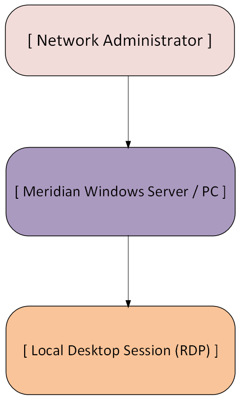

# Remote Desktop Protocol (RDP) Administration

## Overview

This section documents the configuration and validation of Remote Desktop Protocol (RDP) within the Meridian Financial Services Windows infrastructure. 

RDP provides secure, encrypted remote graphical access to Windows servers and workstations, enabling efficient system administration, troubleshooting, and support without requiring physical console access.

---

## Architecture

---

## Design Objectives

- **Remote Administration:** Enable efficient management of Windows infrastructure from a centralized administrative workstation.
- **Operational Efficiency:** Reduce the need for physical access to server rooms or remote branch offices.
- **Secure Access:** Ensure RDP is configured with appropriate security controls (such as Network Level Authentication) to prevent unauthorized access.

---

## Implementation Scope

### Service Configuration
- Enabling the Remote Desktop service on the target Windows system.
- Configuring system properties to allow remote connections.

### Functional Validation
- Initiating an RDP connection from a remote administrative client.
- Verifying successful authentication and session establishment.

---

## Security Considerations

In a production enterprise environment, RDP is a high-value target for attackers. The Meridian design enforces the following security best practices (documented conceptually here):
- **Network Level Authentication (NLA):** Requires authentication before a full RDP session is established, reducing exposure to denial-of-service attacks.
- **Firewall Restrictions:** RDP (TCP 3389) should only be accessible from trusted management subnets (e.g., via the Windows Firewall GPO).
- **Least Privilege:** Only authorized administrators should be members of the "Remote Desktop Users" group.

---

## Documentation Structure

| Document | Purpose |
| :--- | :--- |
| `README.md` | Architecture, design objectives, and security considerations. |
| `configuration.md` | Implementation details, functional testing, and evidence matrix. |
| `screenshots/` | Curated evidence of RDP configuration and successful session. |

---

## Scope & Boundaries

This section documents **basic RDP service configuration and connectivity validation**. 

Advanced RDP security features (such as Remote Desktop Gateway, Smart Card authentication, or complex GPO restrictions) are outside the scope of this specific validation but are acknowledged as critical for production deployment.
