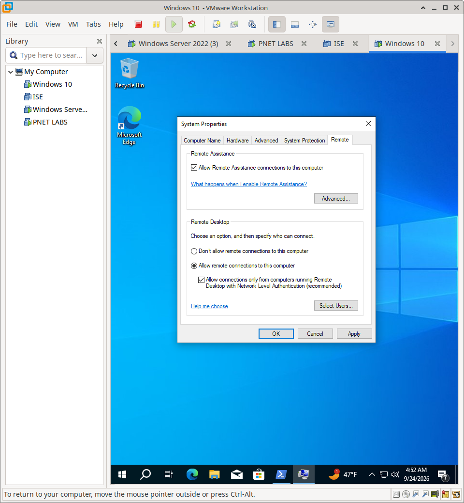

# RDP Implementation & Validation

## Overview

This document details the configuration of Remote Desktop Protocol (RDP) on the Meridian Windows infrastructure and the functional testing performed to validate remote administrative access.

---

## 1. RDP Service Configuration

To enable remote administration, the Remote Desktop service was enabled on the target Windows system.

**Configuration Steps:**
1. Navigate to **System Properties** > **Remote** tab.
2. Select **"Allow remote connections to this computer"**.
3. Ensure **"Allow connections only from computers running Remote Desktop with Network Level Authentication (recommended)"** is checked to enforce NLA.

---

## 2. Functional Validation (Remote Session)

After configuring the service, a remote administrative client was used to initiate an RDP connection to the target system.

**Test Workflow:**
1. Launch the Remote Desktop Connection client (`mstsc.exe`).
2. Enter the target system's IP address or hostname.
3. Authenticate using valid domain credentials.
4. Verify that the remote desktop session loads successfully and the desktop environment is fully interactive.

**Please enlarge for clearer video**

https://github.com/user-attachments/assets/bd9072b5-1eef-4855-a0c9-b1bac05a9bb1

---

## 3. Evidence

| Verification Stage | Evidence File | What It Proves |
| :--- | :--- | :--- |
| **Service Configuration** | `01-rdp-configuration.png` | RDP service enabled and NLA configured. |
| **Functional Validation** | `rdp.mp4` | Successful remote session established and interactive. |

---

## 4. Scope & Boundaries

This section documents **RDP service configuration and basic connectivity testing**.

**Not covered here:**
- Windows Firewall rule creation for TCP 3389 (covered in `02-DNS-GPO/`)
- Remote Desktop Gateway (RD Gateway) deployment (out of scope)
- Advanced GPO restrictions for RDP (out of scope)
 within the context of **enterprise remote administration and security best practices**.
