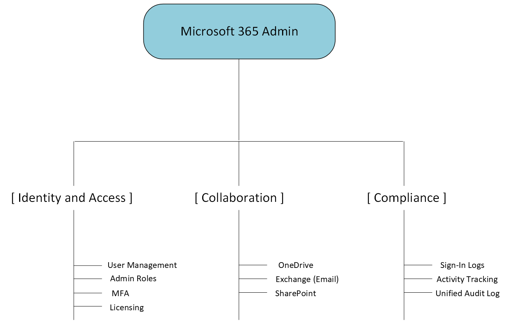

# Microsoft 365 Cloud Administration & Collaboration

## Overview

This section documents the administration, security, and collaboration features implemented within the Microsoft 365 environment for Meridian Financial Services. 

Moving to a cloud-first productivity suite requires strict management of cloud identities, secure access controls, and robust compliance auditing. This implementation covers the full lifecycle of a cloud user—from identity creation and licensing to secure authentication (MFA), role-based access, and collaborative workspaces via SharePoint and OneDrive.

---

## Architecture

The Microsoft 365 implementation is divided into three core pillars:

---

## Design Objectives

- **Centralized Cloud Identity:** Streamline user provisioning, licensing, and application access from a single administrative console.
- **Secure Access:** Enforce Multi-Factor Authentication (MFA) and assign appropriate administrative roles to protect cloud resources.
- **Enterprise Collaboration:** Deploy SharePoint and OneDrive to provide secure, version-controlled document sharing and storage.
- **Compliance & Visibility:** Leverage native Microsoft 365 Audit and Sign-In logs to maintain visibility into user activity and administrative changes.

---

## Implementation Scope

### 1. Identity & Access Management (IAM)
- User creation and license assignment.
- Authentication method configuration and MFA enforcement.
- Administrative role assignment (Principle of Least Privilege).

### 2. Productivity & Collaboration
- OneDrive administration for personal cloud storage.
- Exchange Online configuration (e.g., automatic replies).
- SharePoint site creation, document libraries, and version control testing.

### 3. Compliance & Auditing
- Reviewing Azure AD/M365 Sign-In logs for authentication events.
- Utilizing the Unified Audit Log to track administrative actions and property modifications.

---

## Documentation Structure

| Document | Purpose |
| :--- | :--- |
| `README.md` | Architecture, design objectives, and implementation scope. |
| `configuration.md` | Implementation details, testing methodology, and evidence matrix. |
| `screenshots/` | Curated evidence of M365 admin console, SharePoint, and audit logs. |

---

## Scope & Boundaries

This section documents **Microsoft 365 tenant administration, user security, and native collaboration features**. 

It focuses on the native cloud capabilities demonstrated in the lab. Advanced hybrid identity synchronization (e.g., Entra Connect), Conditional Access policies, or third-party integrations are outside the scope of this specific validation.
