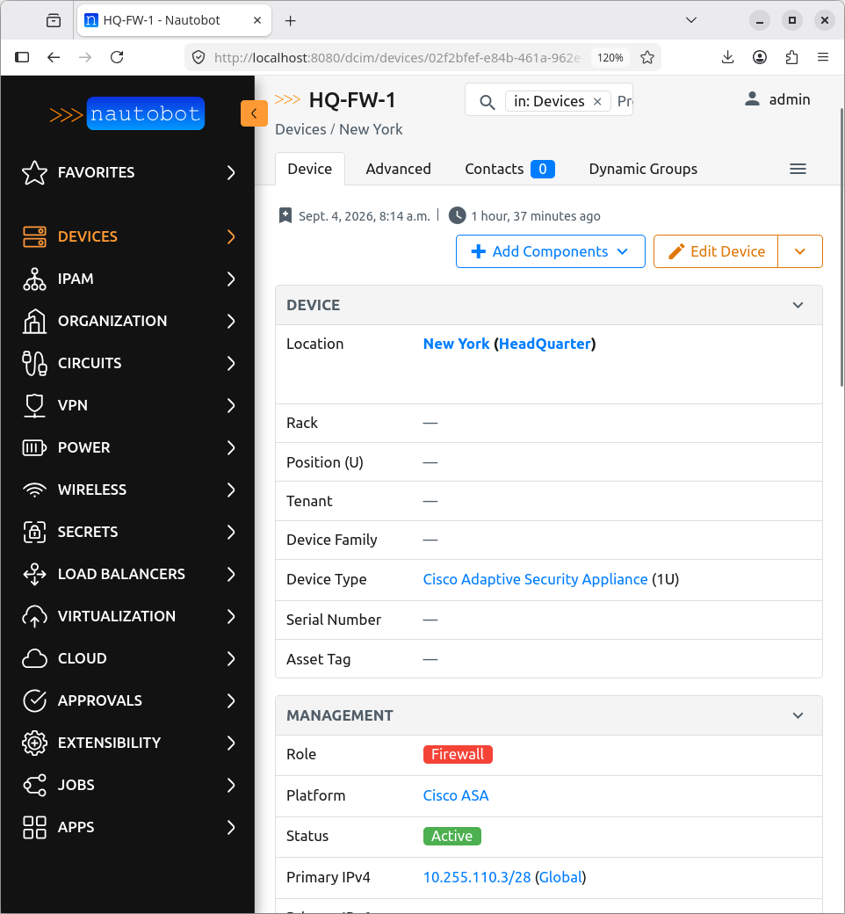
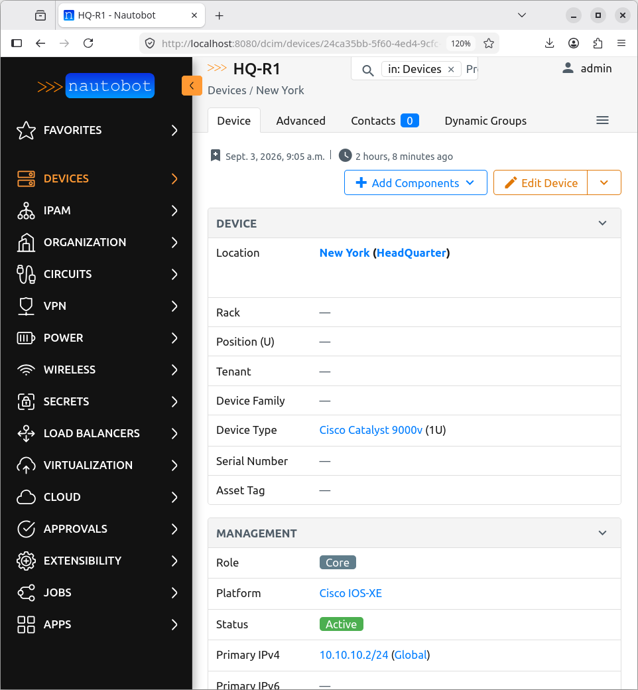
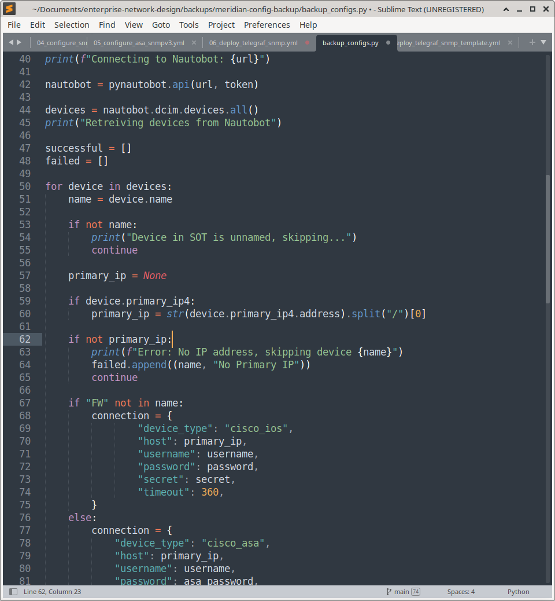
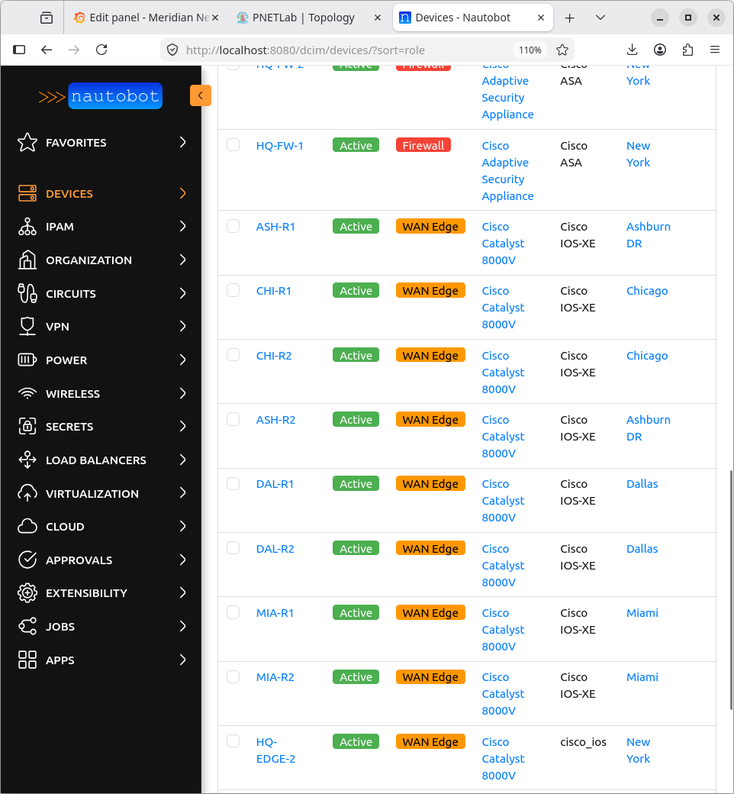
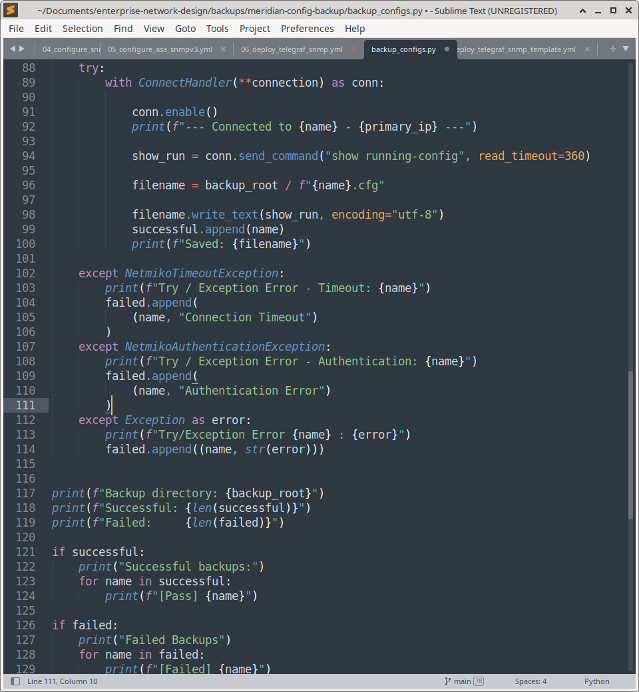
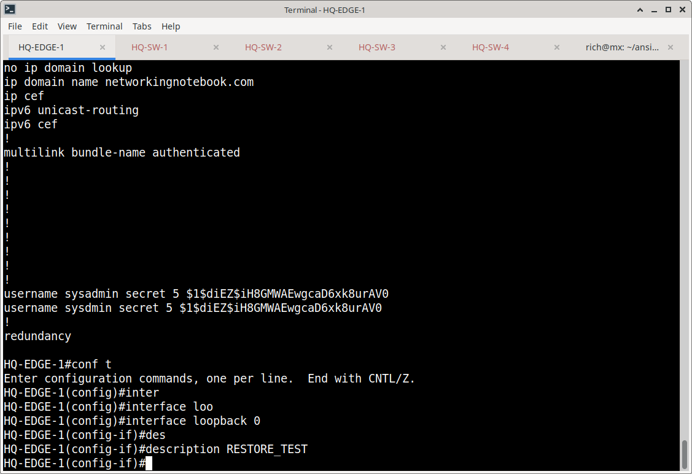
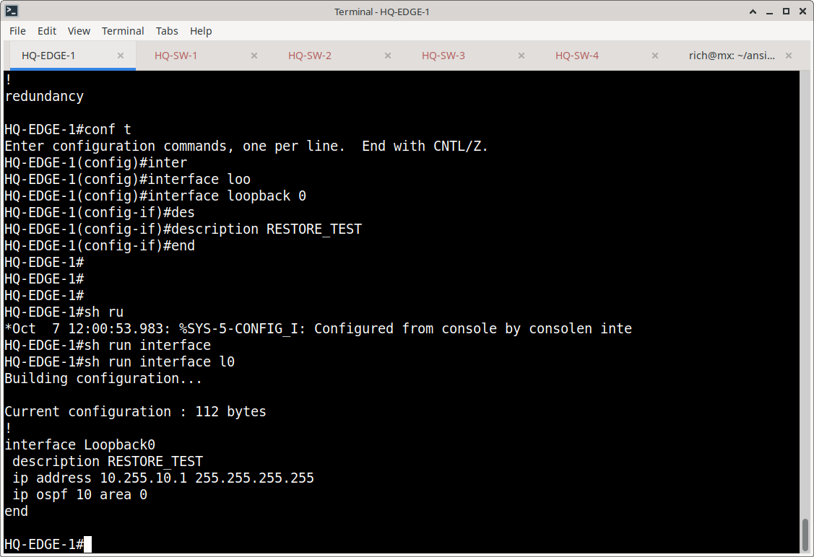
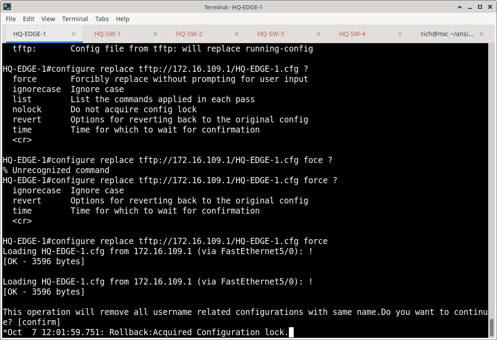
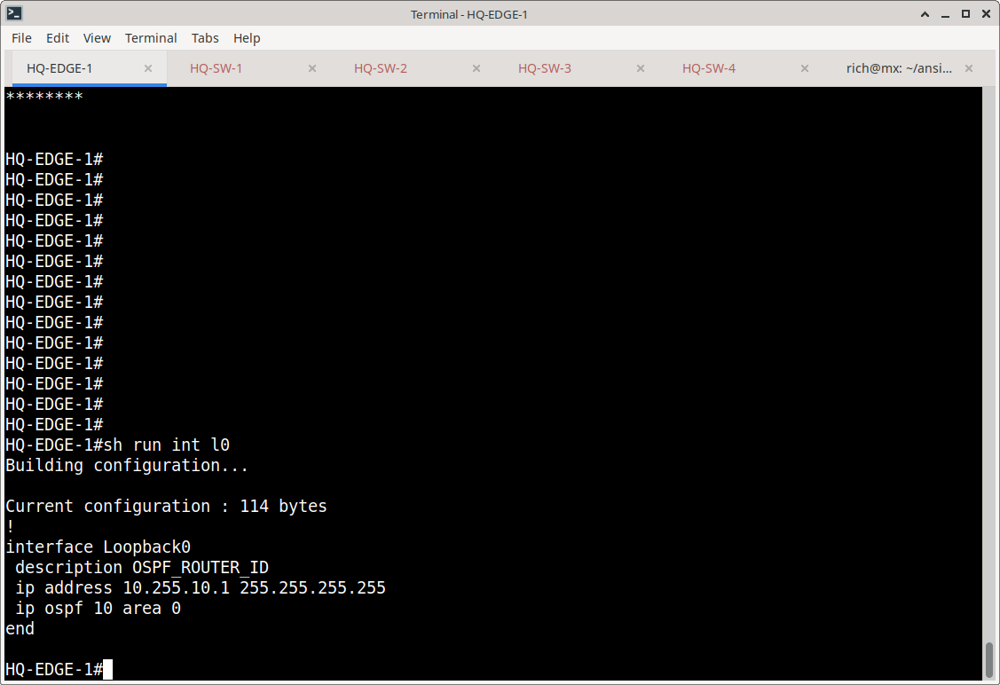

# Backup Automation: Implementation & Validation

## Overview

This document details the implementation, execution, and validation of the Meridian network configuration backup automation. It covers the environment setup, secure credential management, the executed backup workflow, and the operational procedure used to validate backup integrity.

---

## 1. Environment & Dependencies

The automation environment was provisioned using Python 3.x. The following libraries were installed to handle API interactions, secure secret management, and SSH device connectivity:

```bash
python -m pip install pynautobot python-dotenv netmiko
```

---

## 2. Secure Credential Management

To prevent secrets from being exposed in source code, credentials and API tokens were securely managed using a local `.env` file loaded via `python-dotenv`. 

The following environment variables were configured to supply the necessary authentication context for both Nautobot and the target network devices:

```env
NAUTOBOT_URL="http://<nautobot-ip>:8000"
NAUTOBOT_TOKEN="your_nautobot_api_token_here"
SSH_USERNAME="your_ssh_username"
SSH_PASSWORD="your_ios_ssh_password"
SECRET="your_ios_enable_secret"
ASA_PASSWORD="your_asa_ssh_password"
ASA_ENABLE="your_asa_enable_secret"
```
---

## 3. Device Discovery Implementation

Device discovery was implemented using `pynautobot` to dynamically query the Nautobot inventory:

```python
nautobot = pynautobot.api(url, token)
devices = nautobot.dcim.devices.all()
```





For each device, the script was programmed to extract the primary IPv4 address. Devices lacking a primary IP in Nautobot were automatically skipped and logged as failures.




**Connection Type Logic:**  
A naming convention heuristic was implemented to determine the Netmiko device type dynamically:
- Device names containing `FW` were assigned the `cisco_asa` device type.
- All other devices defaulted to the `cisco_ios` device type.



---

## 4. Backup Execution & Output

The backup workflow was executed via the command line:

```bash
python backup_configs.py
```

**Execution Results:**
The script successfully validated the environment variables, authenticated with Nautobot, and iterated through the device list. It generated a new timestamped directory (`configs-backups/YYYY-MM-DD_HH-MM-SS/`) and saved individual `.cfg` files for each successfully polled device.

🎬 **Execution Evidence: Plrease enlarge for clearer video**

---

## 5. Error Handling Implementation

Resilience was built into the script to ensure that a single device failure would not halt the entire batch process. The implemented error handling catches and logs specific exceptions:
- `ValueError`: Triggered when required environment variables are missing.
- `AttributeError`: Triggered when a device is missing a primary IPv4 address in Nautobot.
- `netmiko.ssh_exception.NetmikoTimeoutException`: Triggered on SSH connection timeouts.
- `netmiko.ssh_exception.AuthenticationException`: Triggered on invalid credentials.



---

## 6. Restore Validation Procedure

To prove the generated backups were actually usable, a manual restore test was executed on `HQ-EDGE-1`.

**Validation Steps Performed:**
1. **Test Change Introduced:** A temporary marker was added to the target device to establish a baseline for the restore test:
   ```cisco
   configure terminal
   interface Loopback0
   description RESTORE_TEST
   end
   write memory
   ```
   




2. **Backup Served:** The target `.cfg` file from the `configs-backups/` directory was made accessible via a local TFTP server (`172.16.109.1`).

3. **Configuration Replaced:** The Cisco IOS configuration replacement command was executed to revert the device to the backed-up state:
   ```cisco
   configure replace tftp://172.16.109.1/HQ-EDGE-1.cfg force
   ```
   

  
4. **Integrity Verified:** Post-restore verification confirmed that the `RESTORE_TEST` description was successfully removed, proving the backup's integrity and the viability of the recovery process.



---

Here's an updated section to add to your `configuration.md` that links to the backup examples. I'll add this after the "Backup Execution & Output" section:

---

### Backup Output Structure

The automation successfully generated timestamped backup directories containing the device configurations. The following links provide direct access to the generated backup artifacts from the lab execution:

**Timestamped Backup Runs:**
- 📁 [Backup Run 1](configs-backups/2026-10-06_09-37-39/) - Initial automated backup execution.
-  [Backup Run 2](configs-backups/2026-10-06_09-48-20/) - Subsequent automated backup execution.
- 📁 [Backup Run 3](configs-backups/2026-10-06_09-50-34/) - Final automated backup execution.

**Sample Device Configuration:**
- 📄 [HQ-EDGE-1.cfg](configs-backups/HQ-EDGE-1.cfg) - Example of a sanitized running configuration saved by the script.

*(Note: As this is a lab environment, these files are provided for transparency and portfolio review purposes.)*


***
